#### 项目中面试需要讲的

在广西消防廉政档案里找找看有没有可以写在简历上的模块

广西消防廉政档案的信息采集中信息填报里的修改和新增去学习一下，（**重置的原理我还没用学记得看一下**）

这里的逻辑就是你点击的是修改的时候，将这一行的table栏的数据赋值给一个新的对象，这个对象并不是上面的表单对象，然后通过这个对象是否存在，存在就获取到这个对象内的id属性，提交时传递给后端，当你新增的时候，每一次返回的id都是一个固定值，而你修改的时候是将你拿到的那一行数据的和默认不一样的id传递给后端，后端通过id是否是默认，是默认id就是新增，如果id是数据库中某一个对象具有的，就修改那个对象的数据，新增修改是同一个接口。


深圳编办项目的登录思路

这个系统是一个在编办工作台有一个总的登录页，如果直接没用登录去到其他系统会失败，会跳转到编办工作台的登录页进行登录，当你登录成功即可跳回你原本的那个系统，在编办工作台可以用location.href进行路由跳转到别的系统，当你登录成功，将后端返回的token利用会话存储或本地存储存储起来

了解一下登录的逻辑

使用开源的加密库 crypto-js对密码进行加密，然后后端会用**CryptoJS**.AES.**decrypt**(  '5yOOaUK1NSxVcRc8TA1fZw==',）.toString()的方式进行解密，解密的数据就是明文密码通过加密生成的那个字符串

```js
//这里这个验证码是通过图片获取到，
//这是点击登录的逻辑
let aeskey = "Dp12345678123456";
//利用插件将密码加密
let pwd = CryptoJS.AES.encrypt(this.userLogin.password, aeskey).toString();

const data = {
  grant_type: 'password',
    //用户名
  username: this.userLogin.username,
    //密码
  usercode: pwd,
    //进行验证的通过图片输入的
  captcha: this.userLogin.vccode
};
this.showLoadding = true
try {
  const res = await this.$axios({
    url: 'zxcaptchalogin',//'locallogin',, //平台提供登录接口
    method: 'POST',
    headers: { 'Content-Type': 'application/x-www-form-urlencoded' },
    params: data
  })
  console.log(res, 'res')
  if (!res.tokeninfo) {
    this.$message.error(res.message)
    this.num++
    this.showLoadding = false
    return
  }

  if (res.tokeninfo && res.userinfo) {
    this.$message.success('登录成功')
    sessionStorage.setItem("access_token", res.tokeninfo.access_token)
    sessionStorage.setItem("refresh_token", res.tokeninfo.refresh_token)
    sessionStorage.setItem("token", res.tokeninfo.access_token)
    sessionStorage.setItem("user", JSON.stringify(res.userinfo));

    this.showLoadding = false
    console.log(this.$route, '12132')
      //这里就是原本我们没用登录的时候自动跳转到登录页面，当我们输入账号密码登录成功，就会通过query绑定的这个字段进行路由跳转跳转回你原本未登录的页面
    this.$router.push(this.$route.query.redirect || '/')
  }
} catch (err) {
  this.showLoadding = false
  this.$message.error(err.message)
}
```

两个不关联的数据


这里当我们输入以后，点击确认按钮需要正则判断，当输入符合要求就将这个值赋给我们的文号，所以文号和输入框的数据是两个数据。如果设置成一个数据，那么你还没有进行判断这个值就动态给了文号框了

##### echarts地图自定义地图引入（有一个问题，深山合作区的经纬度其实是不对的）

利用geojson.io这个网站进行描点，获取到我们指定区域的经纬度的json字符串文件，然后给每个区域指定名字，如南山区

我这里可以将里面echarts的点击事件获取到我配置到区域内部的name名字，也就是如宝安区，南山区这种区域，然后将这个区域利用store存储，在每个需要用到的模块利用computed获取到这个属性，然后监听这个值就可以做到点击不同区域，获取到不同区域的参数了

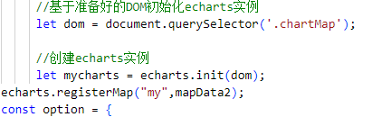

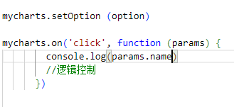


创建百度地图的实例

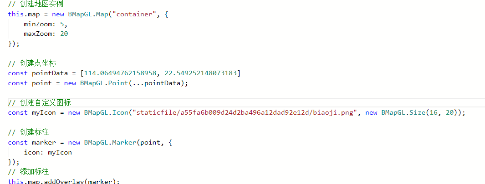

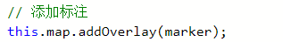

引入真实的百度地图，首先是new一个百度地图辅助工具的实例 this.map=BMapGL.Map(),然后创建初始展示的点坐标的经纬度，这样地图初始化完成直接就会显示我们设置的经纬度那个坐标，我们使用的时候是利用展开树节点，初始的树节点是深圳的各个区，如深圳市，南山区，宝安区等，然后通过树形懒加载，当我们点击某一个区的时候获取到该区下的如党委系统，人大系统，政府系统之类的不同系统的分类，然后再点击会到具体所属单位，当我们点击时候，会获取到我们存储的指定每个单位的经纬度，然后利用百度地图的实例创建这个点var point = new BMapGL.Point(item.jd, item.wd);地图会立刻跳转经纬度到那个单位的位置，并展示单位的基本信息，如简介，还有电话等，然后点击这个单位的机构画像点击事件判断你是最后一级的节点，在路由上面利用query携带上你指定的单位名，跳转到这个单位的机构画像模块，并通过这个单位名这个模块发请求，从后端拿到这里指定的数据展示，在这里我们利用echarts展示了单位的人员分布，单位入编出编情况，在职人员的情况的echarts图，并且能够看到单位的历史沿革的的富文本。


##### 后台管理系统中的权限管理是怎么实现的？（我做的那个是在仓库中进行判断，原理是类似的）

**登录：** 当用户填写完账号和密码后向服务端验证是否正确，验证通过之后，服务端会返回一个 token，

拿到 token 之后（我会将这个 token 存贮到 cookie 中，保证刷新页面后能记住用户登录状态），前端会 根据 token 再去拉取一个 user_info 的接口来获取用户的详细信息（如用户权限，用户名等等信息）。

**权限验证：** 通过 token 获取用户对应的 权限，动态根据用户的 权限算出其对应有权限的路由，通过 router.addRoutes 动态挂载这些路由。

**具体思路：**

登录成功后，服务端会返回一个 **token**（该 token 的是一个能唯一标示用户身份的一个 key），之后我 们将 token 存储在本地 cookie 之中，这样下次打开页面或者刷新页面的时候能记住用户的登录状态，不 用再去登录页面重新登录了。

ps:为了保证安全性，我司现在后台所有 token 有效期(Expires/Max-Age)都是 Session，就是当浏览器关 闭了就丢失了。重新打开游览器都需要重新登录验证，后端也会在每周固定一个时间点重新刷新 token，让后台用户全部重新登录一次，确保后台用户不会因为电脑遗失或者其它原因被人随意使用账 号。

用户登录成功之后，我们会在全局钩子 router.beforeEach 中拦截路由，判断是否已获得 token，在 获得 token 之后我们就要去获取用户的基本信息了 页面会先从 cookie 中查看是否存有 token，没有，就走一遍上一部分的流程重新登录，如果有 token, 就会把这个 token 返给后端去拉取 user_info，保证用户信息是最新的。 当然如果是做了单点登录得功 能的话，用户信息存储在本地也是可以的。当你一台电脑登录时，另一台会被提下线，所以总会重新登 录获取最新的内容。

先说一说我权限控制的主体思路，前端会有一份路由表，它表示了每一个路由可访问的权限。当用户登 录之后，通过 **token** 获取用户的 **role** ，动态根据用户的 role 算出其对应有权限的路由，再通过 **router.addRoutes** 动态挂载路由。但这些控制都只是页面级的，说白了前端再怎么做权限控制都不是 绝对安全的，后端的权限验证是逃不掉的。

我司现在就是前端来控制页面级的权限，不同权限的用户显示不同的侧边栏和限制其所能进入的页面(也 做了少许按钮级别的权限控制)，后端则会验证每一个涉及请求的操作，验证其是否有该操作的权限，每 一个后台的请求不管是 get 还是 post 都会让前端在请求 header 里面携带用户的 token，后端会根据 该 token 来验证用户是否有权限执行该操作。若没有权限则抛出一个对应的状态码，前端检测到该状 态码，做出相对应的操作。 使用 vuex 管理路由表，根据 vuex 中可访问的路由渲染侧边栏组件。

**具体实现：**

创建 vue 实例的时候将**vue-router**挂载，但这个时候 vue-router 挂载一些登录或者不用权限的公用的页 面。

当用户登录后，获取用**role**，将 role 和路由表每个页面的需要的权限作比较，生成最终用户可访问的路 由表。

调用**router.addRoutes**(store.getters.addRouters)添加用户可访问的路由。

使用**vuex**管理路由表，根据 vuex 中可访问的路由渲染侧边栏组件。


作者：MC猴
链接：https://juejin.cn/post/7056400571967733774
来源：稀土掘金
著作权归作者所有。商业转载请联系作者获得授权，非商业转载请注明出处。

#### 八股文html，css，js，vue

##### 1.html5的新特性，

https://blog.csdn.net/weixin_45709829/article/details/115433620

web worker

https://blog.csdn.net/weixin_44380380/article/details/130552704

##### css3的新特性，

过渡；

谁过渡就给谁加transition： CSS属性，花费时间，效果曲线(默认ease)，延迟时间(默认0)

动画

animation：动画名称，一个周期花费时间，运动曲线（默认ease），动画延迟（默认0），播放次数（默认1），是否反向播放动画（默认normal），是否暂停动画（默认running）然后设置一个关键帧@keyframes ，通过0%到100%设置不同的动画效果实现

transform转换 translate，rotate，scale ；可以利用transform-orgin设置转换的初始位置

新增了很多选择器，结构伪类选择器如nth-child；

盒子阴影box-shadow: 水平阴影的位置 垂直阴影的位置 模糊距离 阴影的大小 阴影的颜色 阴影开始方向（默认是从里往外，设置inset就是从外往里）;

文字阴影text-shadow:水平阴影，垂直阴影，模糊的距离，以及阴影的颜色。

边框圆角；https://blog.csdn.net/qq_46048008/article/details/126406331

flex布局；

渐变：linear-gradient

颜色rgba  最后一个参数表示的是透明度

媒体查询做响应式布局

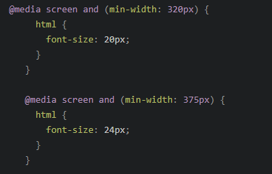


##### es6的新特性（常用的即可）

##### 2.js的数据类型，js数据类型的判断，就记忆三种，typeOf，instanceOf，Object.prototype.toString.call() 

注意点就是typeof只能判断基本数据类型，null会被判断为object；instanceOf只能判断引用数据类型，且数组也会被判断为对象，虽然这是没错的，但是比如在手写深拷贝的时候需要注意，且undefined和null不能判断，例如 a instanceof b，因为instanceof是判断a是否为instanceof原型链上的构造函数，Object.prototype.toString.call() 是最全面的。而 a.constructor ==b 来判断a的类型，的这个constructor其实也是原型链上其实完整的写法是a.--prototype--.constructor;因为原型链的关系，a上面没有constructor这个属性，就会沿着a的构造函数的prototype去查找，所以这里用的实际是实例对象的constructor属性

##### 3.常用的盒子水平垂直居中方法，子绝父相和flex布局实现即可

##### 4.let，const，var的异同点，链接https://blog.csdn.net/weixin_57677300/article/details/126617174

**let**和**const**具有块级作用域，**var**不存在块级作用域,可以跨块访问, 不能跨函数访问

var存在变量提升，let和const不存在变量提升，变量能在声明之前使用，就是变量提升

var声明变量时，可以重复声明变量，后声明的同名变量会覆盖之前声明的遍历。const和let不允许重复声明变量

在变量声明时，var 和 let 可以不用设置初始值。而const声明变量必须设置初始值

let创建的变量是可以更改指针指向（可以重新赋值）。但const声明的变量是不允许改变指针的指向。

```js
// 使用 const 关键字定义衡量，const 限制的是给衡量分配值的动作，并不限制衡量中的值，如下操作都是可以的
const app = ['☃️', '🌈']
        console.log(...app)
        app.push('🤣')
        console.log(...app)
        app[0] = 1
        console.log(app);
//但是如果你给常量从新分配一个值就错了，这就是错的
app=10
```

##### 5.回流（重排）和重绘，能讲出来即可

当DOM的变化影响了元素的几何信息(DOM对象的位置和尺寸大小)，浏览器需要重新计算元素的几何属性，将其安放在界面中的正确位置，这个过程叫做回流（重排）

当一个元素的外观发生改变，但没有改变布局,重新把元素外观绘制出来的过程，叫做重绘，改变元素的color，background，box-shadow等属性

##### 6.盒子模型

  常规是box-sizing：content-box；当设置了内边距和边框会撑大盒子  奇异盒模型：box-        sizing：border-box；内边距和边框都包含再盒子的尺寸里面

##### 7.清除浮动的方法：  

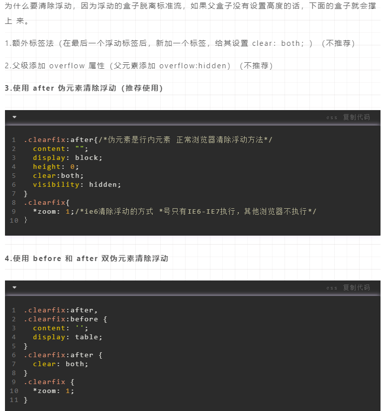

##### 8.圣杯和双飞翼布局

就是常见的两侧固定，然后中间自适应，用felx布局可以很轻松实现，左右两侧写死宽度，中间的盒子flex:1，就是剩余的宽度全部给中间盒子，而利用order属性即可解决中间部分可能被两侧遮挡的问题；利用浮动比较不好实现

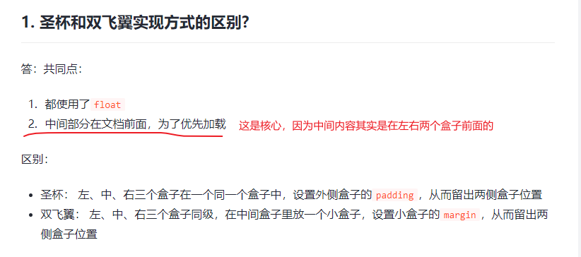

##### 9.请列举几种隐藏元素的方法

· visibility: hidden;这个属性只是简单的隐藏某个元素，但是元素占用的空间仍然存在
· opacity: 0; CSS3属性，设置0可以使一个元素完全透明，但不会改变页面布局，并且，如果该元素已经绑定一些事件，如click事件，那么点击该区域，也能触发点击事件的
· display: none;元素会变得不可见，并且不会再占用元素位置。会改变页面布局。
· transform: scale(0);将一个元素设置为缩放无限小，元素将不可见，元素原来所在的位置将被保留。

##### 10.cookies,sessionStorage,localstorage区别

相同点：都存储在客户端
不同点：1.存储大小

· cookie数据大小不能超过4k。

· sessionStorage和localStorage 虽然也有存储大小的限制，但比cookie大得多，可以达到5M或更大。

2.有效时间

· localStorage    存储持久数据，浏览器关闭后数据不丢失除非主动删除数据；

· sessionStorage  数据在当前浏览器窗口关闭后自动删除。

· cookie          设置的cookie过期时间之前一直有效，即使窗口或浏览器关闭

3. 数据与服务器之间的交互方式

· cookie的数据会随着http请求自动的传递到服务器，服务器端也可以写cookie到客户端

· sessionStorage和localStorage不会自动把数据发给服务器，仅在本地保存。

4.后两者有建议的增删改查方法，而cookies需要封装

##### 11.优先级

!important > 内联 > ID 选择器 > 类选择器 > 标签选择器。

##### **12.外边距塌陷问题解决办法**（这里和下方BFC一起看 BFC就可以解决这个问题）

产生原因:1.父子元素，给子元素一个margin-top=50px，我们想要的效果是子元素距离父元素顶部50px，但是实际上效果是图2，父子元素一起距离顶部50px；2.同级元素，垂直方向上方那个div设置下外边距，下方那个div设置上外边距，实际的距离不是两者之和而是两个外边距中大的那个外边距

父子级元素如下

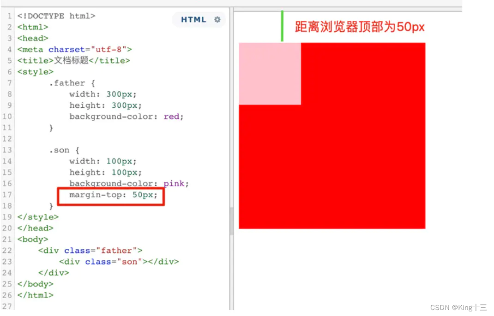

这里我们知道了 设置BFC区域后，子元素相对于父元素也是独立的

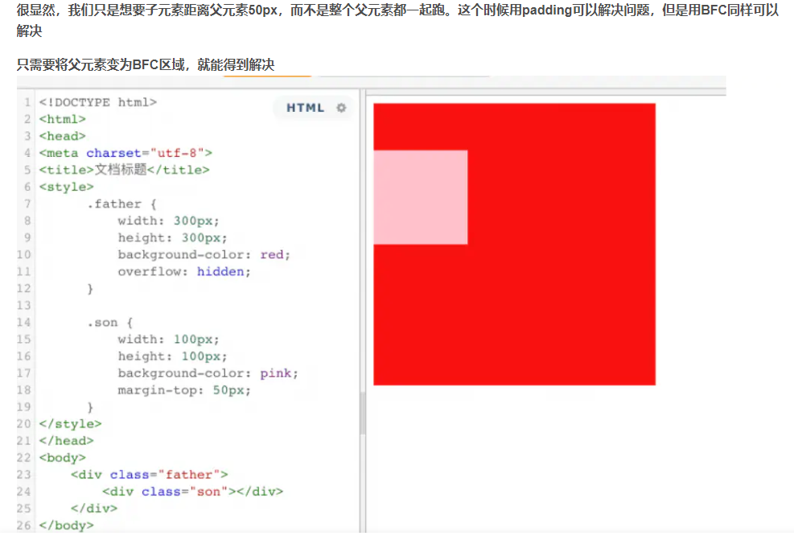

解决方案:

1. 给父元素加边框`border`
2. 给父元素加内边距`padding`

3. 给父元素加`overflow:hidden`（这个貌似就是BFC原理实现的）

   两同级元素遇到外边距合并解决办法

   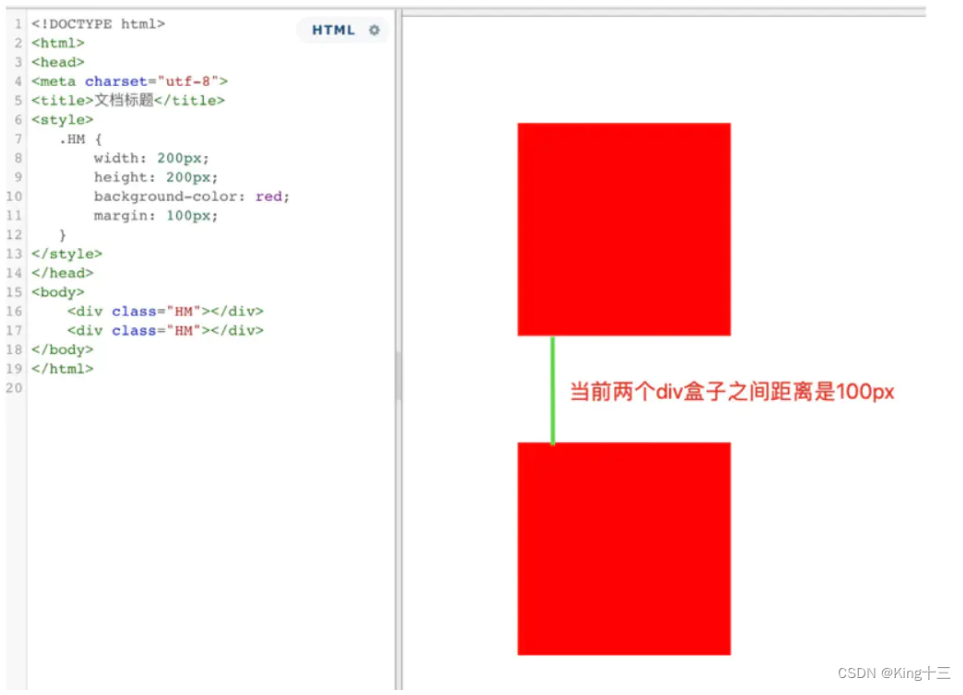

   让这两个元素都变为BFC即可，也就是两个元素都分别加一个父元素，都加一个overflow：hidden

   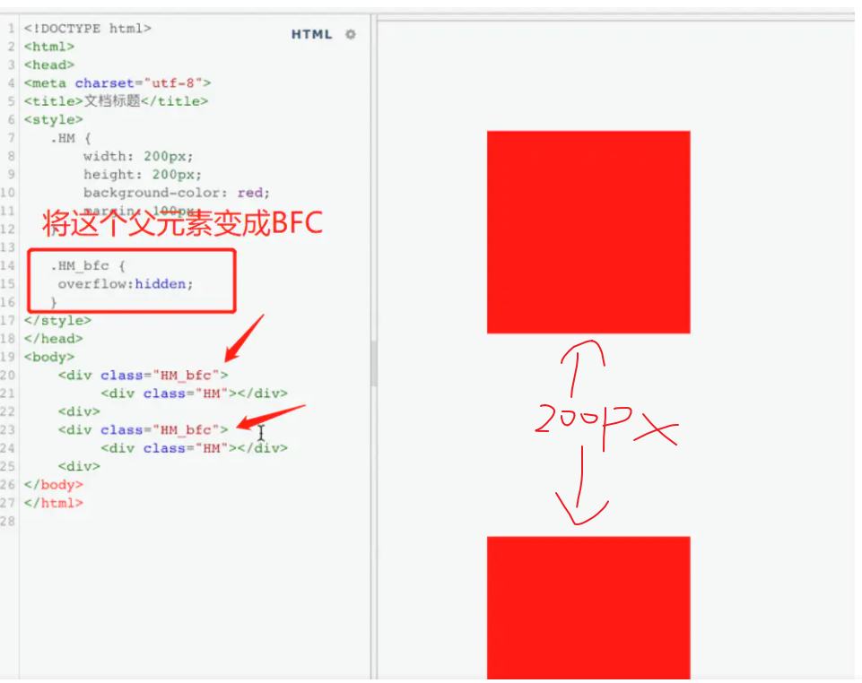

##### **13.BFC(`Block Formatting Context `的缩写，即块格式化上下文)**

如何使一个元素变为BFC区域：

·设置浮动，也就是display:left和display:right可以而display：none不行
·设置定位，absoulte或者fixed
·行内块显示模式，inline-block
·设置overflow，即hidden，auto，scroll，只有visable不行
·表格单元格，table-cell

·弹性布局，flex

**BFC作用 （解决了什么问题）**

1. 阻止margin重叠（就是上面12的会导致外边距塌陷的两种情况）

2. 可以包含浮动元素 —— 清除内部浮动

3. 自适应两栏布局，

4. 可以阻止标准流元素被浮动元素覆盖  （**3和4是一样的，如下）**

   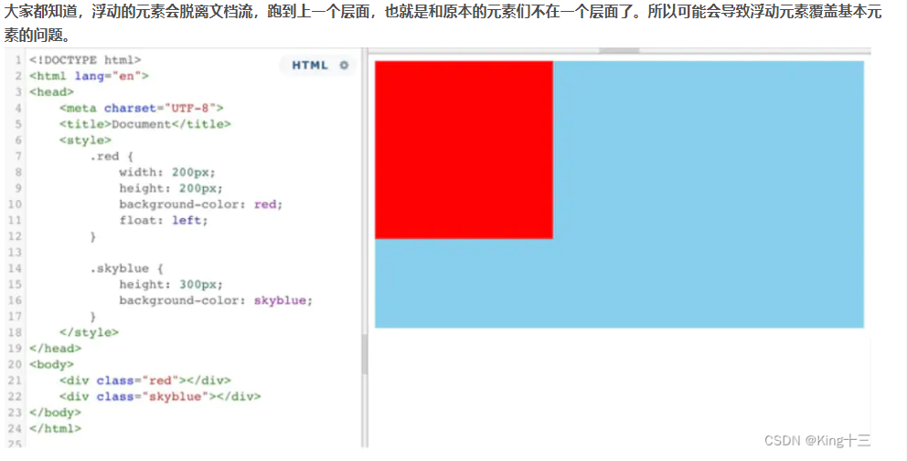

   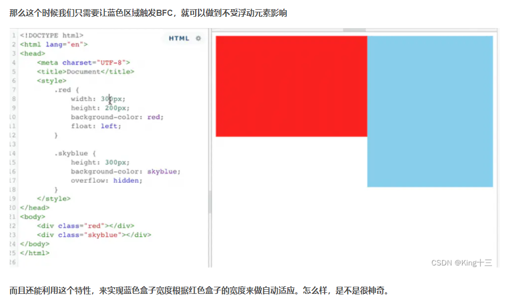

   

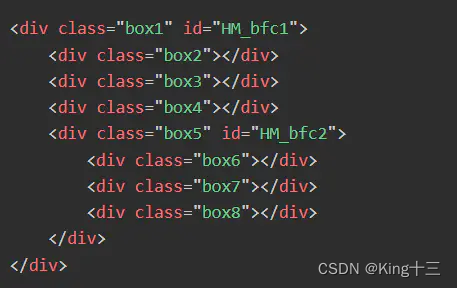

假设box1和box5是两个BFC区域，那么根据上述原理能理解到的就是，box1这个BFC区域包含了子元素box2，box3，box4，box5。但不包括box678。而box5这块BFC区域则包含了box678这三个子元素。

总结:
1,每一个BFC区域只包括其子元素，不包括其子元素的子元素。
2,每一个BFC区域都是独立隔绝的,互不影响
第一条就是字面意思，第二条直接看代码理解


##### **15.垃圾回收机制和内存机制**

垃圾回收

浏览器的js具有自动垃圾回收机制，垃圾回收机制也就是自动内存管理机制，垃圾收集器会定期的找出那些不在继续使用的变量，然后释放内存。但是这个过程不是实时的，因为GC开销比较大并且时停止响应其他操作，所以垃圾回收器会按照固定的时间间隔周期性的执行。

**内存泄露（关于这个问题我收藏在掘金）**

如果 那些不再使用的变量，它们所占用的内存 不去清除的话就会造成内存泄漏

内存泄露其实就是我们的程序中已经动态分配的堆内存，由于某些原因没有得到释放，造成系统内存的浪费导致程序运行速度减慢甚至系统崩溃等严重后果。

比如说：

1、不正当的闭包：在闭包中引入闭包外部的变量时，当闭包结束时此对象无法被垃圾回收（GC）。


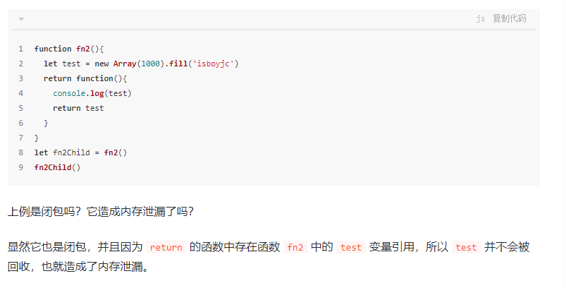

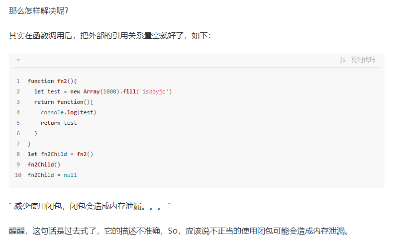

2、DOM：当原有的DOM被移除时，这个dom的子结点引用没有被移除则无法回收

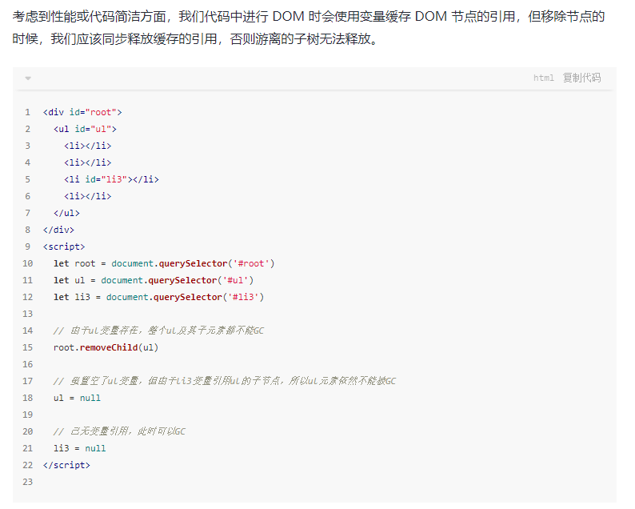

3、遗忘的定时器

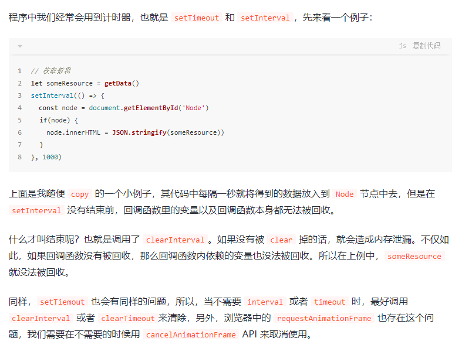

4.隐式全局变量,就是没有用let const声明的变量

**解决内存泄漏的方法**

1. 变量先声明后使用。

2. setTimeout setInterval清理 （最好不用）可以使用nextTick代替。

3. 如果在mounted/created 钩子中绑定了DOM/BOM 对象中的事件，需要在beforeDestroy 中做对应解绑处理。

   mounted () { window.addEventListener('resize', this.onResize) }, beforeDestroy () { window.removeEventListener('resize', this.onResize) }

4. 如果在mounted/created 钩子中使用了on，需要在beforeDestroy 中做对应解绑(off)处理。

   mounted () { this.EventBus.EventBus.EventBus.on('exitClassRoom',this.exitClassRoomHandle) }, destroyed () { this.EventBus.EventBus.EventBus.off('exitClassRoom',this.exitClassRoomHandle) }

5. 如果在mounted/created 钩子中使用了第三方库初始化，需要在beforeDestroy 中做对应销毁处理。

6. 慎用keep-alive
    当你用 keep-alive 包裹一个组件后，它的状态就会保留，因此就留在了内存里，切莫在整个路由页面上加上keep-alive。
    一旦你使用了 keep-alive，那么你就可以访问另外两个生命周期钩子：activated和 deactivated。你需要在一个 keep-alive 组件被移除的时候，调用 deactivated 钩子进行清理或改变数据。


#### **16.作用域**

1、作用域

作用域就是一个变量可以使用的范围，主要分为全局作用域和函数作用域，以及es6提出的块级作用域。

全局作用域就是Js中最外层的作用域

函数作用域是js通过函数创建的一个独立作用域，函数可以嵌套，所以作用域也可以嵌套

Es6中新增了块级作用域（由大括号包裹，比如：if(){},for(){}等）

2、自由变量

当前作用域外的变量都是自由变量，一个变量在当前作用域没有定义，但是被使用了，就会向上级作用域，一层一层依次查找，直至找到为止，如果全局作用域都没有找到这个变量就会报错。这个自由变量查找的过程就是作用域链。

3、变量提升（通俗讲就是可以先赋值再声明）

每个var声明的变量，function声明的函数存在变量提升。let const不存在变量提升

在js中声明之前未定义，会在js的最上方会形成一个预解析池，用来存储声明了但没有先定义的变量名

4、作用域链

当一个变量在内部就有时就不需要使用到作用域链， 作用域链就是从当前作用域开始一层一层向上寻找某个变量，直到找到全局作用域还是没找到，就宣布放弃。这种一层一层的关系，就是`作用域链`。


#### **17.事件循环**（Event Loop）

首先js的运行机制是单线程，单线程就是所有的任务放在一个主进程上，前面的任务没有完成，后面的任务就必须一直等待，同步任务就是这样执行的。而事件循环是单线程的JavaScript在处理异步事件时进行的一种循环过程。

执行流程：

1.在代码执行的时候，所有同步任务都在主线程上执行，形成一个函数调用栈（执行栈）

2.主线程之外，还存在一个‘任务队列’（task queue），浏览器中的各种 Web API 为异步的代码提供了一个单独的运行空间，当异步的代码运行完毕以后，会将代码中的回调送入到 任务队列中，遇到异步宏任务则将异步宏任务放入宏任务队列中，遇到异步微任务放入到微任务队列中

3.一旦主线程的执行栈中的所有同步任务执行完毕后，调用栈为空时系统就会优先将任务队列中的异步微任务压入调用栈中执行，当异步微任务执行完，再将异步宏任务压入执行栈中执行，只要调用栈为空，就会不断循环检测任务队列中是否有代码需要执行，一直循环直到所有任务执行完毕

其中：微任务包括了 promise .then，node 中的 process.nextTick 、对 Dom 变化监听的 MutationObserver。宏任务包括了 script 脚本的执行、setTimeout ，setInterval ，setImmediate 一类的定时事件，还有如 I/O 操作、UI 渲染等。


#### **18.dom和bom**（看csdn收藏在js八股文里的文章）

如果要我描述dom和bom,我可以这样说。首先JavaScript由dom和bom和ECMAscript三者构成，其中ECMAscript是JavaScript在浏览器执行的标准

DOM（Document Object Model是指文档对象模型，是为了操作（xml，html）文档出现的接口**。**为JavaScript提供了一种访问和操作HTML元素的"方法"。document.querySelect不属于dom提供的操作dom元素的方法，是另外一种规范提供的。在浏览器解析HTML标签时，会构建一个DOM树结构。根节点是document对象

BOM 是 Browser Object Model，浏览器对象模型。BOM 是为了控制浏览器的行为而出现的接口。为JavaScript提供了一种控制浏览器行为的"方法"。并且dom树也会映射到bom的document对象上

关于JavaScript中DOM的一些常见的操作html元素的方法

获取节点的DOM方法

```js
//1.通过元素的id属性值来获取元素，返回的是一个元素对象
var element = document.getElementById(id_content)

//2.通过元素的name属性值来获取元素，返回的是一个元素对象的数组
var element_list = document.getElementsByName(name_content)

//3.通过元素的class属性值来获取元素，返回的是一个元素对象的数组
var element_list = document.getElementsByClassName(class_content)

//4.通过标签名获取元素，返回的是一个元素对象数组
var element_list = document.getElementsByTagName(tagName)
```

创建节点(Node)的DOM方法

```javascript
//1.创建一个html的元素，传参是元素类型，例如div、h1-5、a，下以div为例
var element = document.createElement("div")
```

增添节点的DOM方法

```js
//1.向element内部的最后面添加一个节点，传入的参数是节点类型
element.appendChild(Node)

//2.向element内部某个已存在的节点的前面插入一个节点，仍然传入一个节点类型的参数
element.insertBefore(new_Node,existed_Node)
```

删除节点的DOM方法

```javascript
//删除element内的某个节点，传参是节点类型参数
element.removeChild(Node) 
```

DOM常见的一些属性
最后是一些常见的DOM属性：

```js
//1.获取当前元素的父节点
var element_father = element.parentNode

//2.获取当前元素的html元素型子节点
var element_son = element.children

//3.获取当前元素的所有类型子节点，包括html元素、文本和属性
var element_son = element.childNodes

//4.获取当前元素的第一个子节点
var element_first = element.firstChild

//5.获取当前元素的前一个同级元素
var element_pre = element.previousSibling

//6.获取当前元素的后一个同级元素
var element_next = element.nextSibling

//7.获取当前元素的所有文本，包括html源码和文本
var element_innerHTML = element.innerHTML

//8.获取当前元素的所有文本，不包含html源码
var element_innerTEXT = element.innerText
```

Bom

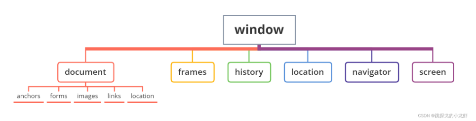

**window对象**

从上面这张图上，我们可以看到：

> **window是整个BOM树食物链的顶端**，因此**每一个新打开的窗口，都被认为是一个window对象。**最常用的有setInterval和setTimeout这两个定时器，还包含操作dom的document对象，
>
> 还有alert(string)：创建一个警示框；close()：关闭窗口

Location对象：常用的方法如window.location.href（）可以实现网页的跳转

🌳history对象
什么是history对象？

history 对象是 window 对象的属性，它保存着用户上网的记录，这个记录的时间戳是从窗口被打开的那一刻算起。

history对象有以下常见的属性和方法：

属性/方法	描述
length	history 对象中的记录数
back()	前往浏览器历史条目前一个 URL，类似后退
forward()	前往浏览器历史条目下一个 URL，类似前进
go(num)	浏览器在 history 对象中向前或向后

🌳navigator对象
最后介绍一下navigator对象：

navigator对象，是BOM中识别客户端浏览器的一个window属性。

与navigator相关的一些常见属性：

属性	说明
appName	完整的浏览器名称和版本信息
platform	浏览器所在的系统平台
plugins	浏览器中安装的插件信息的数 组
userAgent	浏览器的用户代理字符串
userLanguage	操作系统的默认语言

##### **19.箭头函数**

js中我们在调⽤函数的时候经常会遇到this作⽤域的问题，这个时候ES6给我们提箭头函数。

1、 箭头函数是匿名函数不能作为构造函数，不能使用new

2、 箭头函数不绑定arguments,取而代之用rest参数…解决

3、 this指向不同,箭头函数的this在定义的时候继承自外层第一个普通函数的this

5、 箭头函数没有prototype(原型)，所以箭头函数本身没有this

6、 箭头函数不能当做Generator函数,不能使用yield关键字、

7、 写法不同，箭头函数把function省略掉了 （）=> 也可以吧return 省略调 写法更简洁

8、箭头函数不能通过call（）、apply（）、bind（）方法直接修改它的this指向。

补充：谈一下arguments剩余参数和rest参数和拓展运算符的区别

```js
//动态参数（es5），是类数组对象，和数组的相同点在于有length长度，其他的都不一样，只是和数组长得像，属性名是系统自动生成的字符串0，1，2 依次类推
function test() {
   console.log(arguments);
}
test(2, 5, 3) // [2, 5, 3]的伪数组 结果如下

```

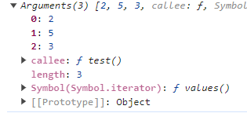

```js
//剩余参数长得和拓展运算符一样，是es6提出的取代动态参数的更优解，因为rest参数是一个真数组，可以使用数组的方法，动态参数是伪数组，无法使用数组的方法。
function test2(...values) {
  console.log(values);
}
test2(2, 5, 3) // [2, 5, 3]   结果如下
```

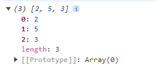

```js
//数组的扩展运算符相当于 rest 参数的逆运算，如上rest参数是把逗号分隔的参数序列转化为了一个数组，而数组的扩展运算符是将一个数组转为用逗号分隔的参数序列。注意：扩展运算符可以将单层的数组或对象实现深拷贝，Object.assign（）方法也可以
console.log(...[1, 2, 3]) // 1 2 3
//常用于合并参数，如下
[...[1,2,3], 4] // [1, 2, 3, 4]

//对象的扩展运算符等同于使用Object.assign()方法，如下两种写法是等价的
let aClone = { ...a };
let aClone = Object.assign({}, a);
//扩展运算符可以用于合并两个对象,如下是等价的
let ab = { ...a, ...b };
let ab = Object.assign({}, a, b);


```

##### **20.数据类型存储以及堆栈内存是什么**（有助于理解引用数据类型）

基本数据类型：直接存储在栈内存中，占据空间小，大小固定，属于被频繁使用的数据。指的是保存在栈内存中的简单数据段；number string 布尔

引用数据类型：同时存储在栈内存与堆内存中，占据空间大，大小不固定。

引用数据：类型将指针存在栈中，将值存在堆中。 当我们把对象值赋值给另外一个变量时，复制的是对象的指针，指向同一块内存地址，意思是，变量中保存的实际上只是一个指针，这个指针指向内存堆中实际的值，数组 对象
堆(heap)和栈(stack)有什么区别存储机制
栈： 是一种连续储存的数据结构，具有先进后出后进先出的性质。

通常的操作有入栈（压栈），出栈和栈顶元素。想要读取栈中的某个元素，就是将其之间的所有元素出栈才能完成。

堆：  是一种非连续的树形储存数据结构，具有队列优先,先进先出； 每个节点有一个值，整棵树是经过排序的。特点是根结点的值最小（或最大），且根结点的两个子树也是一个堆。常用来实现优先队列，存取随意。

##### **21.事件冒泡和事件捕获（用的很少）和事件委托（原理就是事件冒泡），看我收藏的那个js笔记，里面讲的很清楚**

**事件委托，**又名事件代理。事件委托就是利用事件冒泡，就是把子元素的事件都绑定到父元素上。如果子元素阻止了事件冒泡，那么委托也就没法实现了. event.stopPropagation() 可以阻止冒泡，在addeventListener里面的定义的函数后面加上一个true，或者capture：true，就会开启事件捕获，然后事件冒泡就会被关闭，默认是false关闭的状态


##### **22.防抖和节流**

防抖：**所谓防抖，就是指触发事件后在 n 秒内函数只能执行一次，如果在 n 秒内又触发了事件，则会重新计算函数执行时间。**通俗讲就是只执行最后一次，比如在点击某个按钮发起网络请求，如果点击多次会发多次，浪费性能

```js
 //这是利用了闭包的写法,这个timer就是闭包，其实可以放在这个函数外面，那么time就不是闭包了，而且需求依然可以实现  需求：触摸屏幕 只有最后一次会让i增加
const box = document.querySelector('.box')
        let i = 1
        function mouseMove() {
            box.innerHTML = i++
        }
       // let timer //放在这里就不属于闭包了
        function debounce() {
             let timer //放在这里属于闭包
            return function () {
                if (timer) { clearTimeout(timer) }
                timer = setTimeout(function () {
                    mouseMove()
                }, 1000)
            }
        }
        // 这里之所以 debounce需要在鼠标移动事件直接调用是因为里面有return,你调用以后才会return你真正要调用的函数
        box.addEventListener('mousemove', debounce())

//这是没有使用闭包的写法 实现效果是一样的
     const box = document.querySelector('.box')
        let i = 1
        function mouseMove() {
            box.innerHTML = i++
        }
        let timer
        function debounce() {
            clearTimeout(timer)
            timer = setTimeout(function () {
                mouseMove()
            }, 1000)
        }
        box.addEventListener('mousemove', debounce)
```


节流：**所谓节流，就是指连续触发事件但是在 n 秒中只执行一次函数。两种方式可以实现，分别是时间戳版和定时器版。**通俗讲就是规定时间内永远只会执行一次，比如轮播图

```js
 //原理 设置一个节流阀 当timer为假时把定时器赋值给timer，timer就为真了，也就进入了if判断，然后切记当定时器执行完后要给timer从新赋值undefined或null或0让他变为假，这样下次定时器才可以继续执行，注意清除定时器并不会让timer变为假
const box = document.querySelector('.box')
        let i = 1
        function mouseMove() {
            box.innerHTML = `${i}`
            i++
        }

        function throttle() {
            let timer
            return function () {
                if (!timer) {
                    timer = setTimeout(function () {
                        mouseMove()
                        // 当计时器执行完成让timer继续变成0 这样就可以再次执行计时器
                        timer = null
                        console.log(timer)
                    }, 1000)
                }
            }
        }
        // 添加滑动事件 滑动到一秒才数字才变化一次
        box.addEventListener('mousemove', throttle())
```


##### 23.浅拷贝和深拷贝

在理解深浅拷贝之前要知道，基本数据类型：直接存储在栈内存中；引用数据类型：同时存储在栈内存与堆内存中，引用数据的指针存在栈中，将值存在堆中。所以当你直接将对象赋值给其他对象，你给的其实是栈中的内存地址，而不是堆中具体的值

直接赋值，基本数据类型直接赋值过后互相不影响；而对象或数组直接赋值，两个对象或两个数组之间是相互受影响的；’

浅拷贝：当对象或数组内部没有子对象或子数字，只有基本数据类型，也就是单层对象或数组的时候，浅拷贝的的对象和数组与原数组之间互不影响，而原数组或对象内部还有子对象或子数组时，就会相互影响。实现浅拷贝的方式：遍历 ，扩展运算符... 还有函数可以用concat方法，对象可以用Object.assgin方法实现。

深拷贝：多层数组或对象就要使用深拷贝才能实现互不影响，方法如下

```js
 const arr1 = [1, 2,[1,2], 3, 4]
     const   arr2=[]
        const obj1 = { name: '张三', minObj: { age: 12, people: { num: 10 } }, hobby: '篮球' }
        // 这里我长一个教训，我刚开始只是创建了一个obj，但是没有赋值空对象，所以一直报错说obj2的某个属性不存在
        let obj2={}

// 方法1 ，这个方法不推荐使用，因为需要你提前定义一个变量，用方法2
        function deepClone1(clone, newthing) {
            for (let item in clone) {
                if (clone[item] instanceof Array) {
                    newthing[item] = []
                   deepClone1(clone[item], newthing[item])
                } else 
                if (clone[item] instanceof Object) {
                    newthing[item] = {}
                   deepClone1(clone[item], newthing[item])
                } else {
                    newthing[item] = clone[item]
                
                }
            }
            // return newthing
        }
 deepClone1(obj1, obj2)
        obj2.name='李四'
        console.log(obj1);
        console.log(obj2)

        deepClone1(arr1,arr2)
        arr2[1]=100
        console.log(arr1);
        console.log(arr2);


        const arr3 = [1, 2,[1,2], 3, 4]
        const obj3 = { name: '张三', minObj: { age: 12, people: { num: 10 } }, hobby: '篮球' }
       
        // 深拷贝方法2： 这个方法更合理比方法1，可以直接省去子属性再去判断是否为数组，因为对象包含了数组，并且使用的枚举[],赋值数组对象都成立
        // 以后就用这种方法
        function deepClone2(clone) {
            let newThing=clone instanceof Array ? [] :{}
            for (let item in clone) {
                // if (clone[item] instanceof Array) {
                //     newThing[item]=deepClone2(clone[item])
                // } else 
                if (clone[item] instanceof Object) {
                    //这个地方格外注意啊，对象的属性还是对象的时候，进入递归 你得把递归完成的值赋给他才行
                    newThing[item]= deepClone2(clone[item])
                } else {
                    newThing[item] = clone[item]
                }
            }
            return newThing
        }
      let obj4=  deepClone2(obj3)
      obj4.a=1
      console.log(obj3);
      console.log(obj4);
      let arr4=deepClone2(arr3)
    //   arr4[0]=999
      console.log(arr3);
      console.log(arr4);

//深拷贝方法3：原理是首先对象是复杂数据类型 把对象转换成字符串 字符串是简单数据类型 存的就不是地址而直接是一个值，然后再把这个字符串转换成对象，那么就会新开辟一个空间存储这个对象 这个对象就和之前那个对象存在两个不同地方 互不影响 这也就是深拷贝的本质
        const obj = {
            uname: 'pink',
            age: 18,
            hobby: ['乒乓球', '足球'],
            family: {
                baby: '小pink'
            }
        }

        // 把对象转换为JSON字符串
        // console.log(JSON.stringify(obj))
        // 把JSON字符串转换为对象
        const o = JSON.parse(JSON.stringify(obj))
        console.log(o)
        o.family.baby = '123'
        console.log(obj)
```

##### 24.原型链

原型链是一种查找规则是，一个用来实现继承和共享属性的有限的对象链。**获取对象属性时，如果对象本身没有这个属性，那就会去他的原型`__proto__`上去找，如果还查不到，就去找原型的原型，一直找到最 顶层(`Object.prototype`)为止。Object.prototype对象也有proto属性值为null。链式查找机制叫原型链。**

每个函数都有一个prototype属性，被称为显示原型

每个实例对象都会有_ _proto_ _属性,其被称为隐式原型

每一个实例对象的隐式原型_ _proto_ _属性指向自身构造函数的显式原型prototype

每个prototype原型都有一个constructor属性，指向它关联的构造函数。

还有一个点就是某个函数可能同时是某个实例对象的构造函数，也可能是某个构造函数的实例对象，**万物皆对象，函数也是对象**


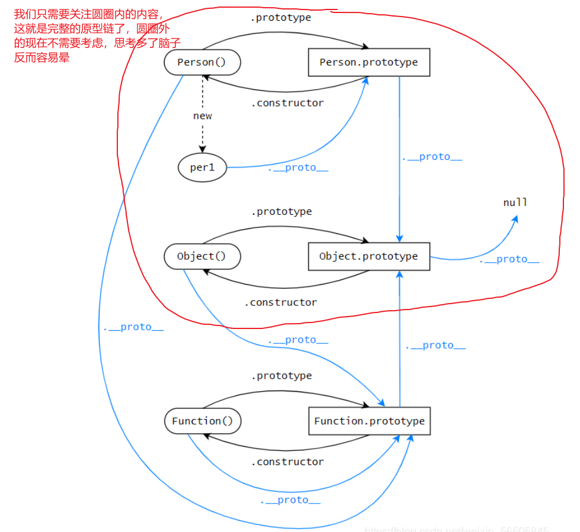

```js
//构造函数
function Person() {

        }
        Person.prototype.sing = function () {
            alert('唱歌')
        }
//实例对象
 const ldh = new Person()
       
        //此处Person是构造函数的身份
        console.log(Person.prototype.__proto__.constructor)//Object

 //此处Person是实例对象的身份，我觉得这个地方我不是很懂 但是不需要在意，因为我目前没有遇到过需要探讨这里的情况
        console.log(Person.__proto__.constructor) //Function

 console.log(ldh.__proto__ === Person.prototype) //true
//由于原型链的关系所以ldh.constructor === Person也为真，因为当ldh发现自己身上没有这个属性的时候，又因为ldh.__proto__ === Person.prototype，ldh就会通过__proto__向构造函数的prototype身上找，发现构造函数的prototype身上有这个属性 然后就可以使用了，所以我们可以通过constructor判断数据类型，但是由于constructor可以被修改，所以不推荐这个方法。
 console.log(ldh.__proto__.constructor === Person) //true,
console.log(Person.prototype.constructor === Person) //true,
 ldh.__proto__.sing()//此处也是ldh也是通过原型链在构造函数的原型对象上找到这个方法并使用的，直接写ldh.sing()也可以

```

##### 25.this指向

this的指向主要有下面几种：

1、this出现在全局函数中,永远指向window

2、 严格模式下this会指向 undefined

3、当某个函数为对象的一个属性时，在这个函数内部this指向这个对象

4、this出现在构造函数中，指向构造函数实例对象

5、当一个元素被绑定事件处理函数时，this指向被点击的这个元素

6、this出现在箭头函数中时，this是外层最近的一个this

##### 26.闭包

1、闭包的概念就是：有权利访问另一个函数作用域中的变量，一般就是函数包裹着函数。

3、闭包可以重用一个变量，且保证这个变量不会被污染的一种机制，就是避免全局污染。这些变量的值始终保持在内存中，不会被垃圾回收机制回收，也就是会造成内存泄漏

4、闭包的缺点：由于闭包会使得函数中的变量都被保存在内存中，内存消耗很大，所以不能滥用闭包，否则会造成网页的性能问题，在IE中可能导致内存泄露。

5、为什么要用闭包：使用场景 : 防抖、节流、函数套函数避免全局污染

闭包解决方法：在退出函数之前，将不使用的局部变量全部删除。

##### 27.call、apply、bind封装与区别

```js
//有一个疑惑 为什么下面算出来结果不一样，按照原型链来说应该是一样的才对吧 ，这个地方暂时放着，
console.log([1, 2, 3].__proto__.slice === [1, 2, 3].slice)//结果为true
        console.log([1, 2, 3].__proto__.slice(1, 3))//结果为空数组[]
        console.log([1, 2, 3].slice(1, 3))// 结果[2, 3]
```

相同点：都可以改变this的指向

call和apply的唯一区别由下可看出，只是传递参数的形式是不一样的，相同的代码求出的结果是完全一样的，并且函数会立即调用，

而bind只会改变this指向，而不会去调用函数，需要你自己去调用，看下面例子就明白了

```js
//可以看出 call和appy不同点：前者接收参数是一个序列，而后者必须是一个数组，但是实际上传递给函数的参数是数组内的变量，而不是这个数组
const obj1 = {
            uname: 'pink'
        }
        function fn(x, y) {
            console.log(this)//原本的是window
           console.log(this.uname)//如果不改变this指向，就不能通过this访问到obj1里面的uname
            console.log(x + y)//3
        }
        // call 改变this指向
        //call用法: 要改变this指向的函数.call(改变成谁,参数1,参数2) 其中参数只能是普通参数 不能是数组
        fn.call(obj1, 1, 2)
//这里是一个很新的用法，通过改变this指向来讲类数组对象转化为数组 下面结果相同
 console.log(Array.prototype.slice.call(arrayLike, 1, 3))
 console.log(Array.prototype.slice.apply(arrayLike, [1,3]))


   
```

```js
  const obj2 = {
            age: 18
        }

function fn(x, y) {
            console.log(this) //window
       console.log(obj2.uname)
            console.log(x + y) //3
        }
        // 1 调用函数
        // 2 改变this指向 
        // apply用法:要改变的函数.apply(改变成谁,[参数1,参数2,.....]) 其中传递参数必须为数组 改变成谁不能省略可以写null空，实际上使用的参数是数组里的属性，而不是这个数组
        fn.apply(obj, [1, 2])    
//巧妙用法求最大最小值 因为Math只能接收一个正常的如100, 44, 77这样的一个序列的参数，而不能接收一个数组
const arr = [100, 44, 77]
        const max = Math.max.apply(null, arr)
        
 //有个疑惑为什么这个式子new Array(1, 2, 3).__proto__.slice === new Array(1, 2, 3).slice相等，但是一旦带参结果就不一样了
        const arrayLike = {
            length: 3,
            0: 2,
            1: 3,
            2: 4,
        }
        //这里是一个很新的用法，通过改变this指向来讲类数组对象转化为数组
        console.log(Array.prototype.slice.call(arrayLike, 1, 3))
        console.log([1, 2, 3].slice(1, 3)) //这里用[1,2,3].__proto__.slice(1,3)结果为空 我就是不理解为什么
   let arr2 = [2, 3, 4]
        console.log(arr2.__proto__.constructor.prototype.__proto__ === Object.prototype)//true
```

```js
 //bind的使用
<button>点击</button>
    <script>
        const obj = {
            age: 18
        }
        function fn() {
            console.log(this)
        }
        // bind 改变this指向
        // 返回值是个函数 但是这个函数里面的this是更改过的obj
        const fun = fn.bind(obj)
        // console.log(fun)
        // fn.bind(obj)()
        fn()
        fun()

        // 需求 有一个按钮 点击里面就禁用 两秒之后恢复可以点击
        // 箭头函数不是万能的比如下面一行的function就不能用箭头函数 用了后面的this指向全部变成window了
        document.querySelector('button').addEventListener('click', function () {
            // 禁用按钮 此处this指向button
            this.disabled = true
            // 定时器这些函数其实前面都有一个window只不过一般都省略了
            window.setTimeout(function () {
                // 下面的代码可以不用bind直接箭头函数 这样这个this指向也是button
                // 还有一种方法 直接把下面的this改成button也可以
                // 由下面的bind所以现在这里的this指向不是window而是button
                this.disabled = false
                // 此处的bind(this)的this就是button 
            }.bind(this), 2000)
        })

      
```

##### 28.es6新特性（具体可以看csdn收藏的js八股文里，我笔记也有，vs直接搜就行	）

promise

新增了块级作用域(let,const)，利用let声明的变量和用const声明的常量无法跨块访问，块级作用域就是用大括号{}包裹的区域，函数作用域虽然也有一个{}，但是不算块级作用域。

新增了模板字符串

函数参数允许设置默认值，引入了 rest 参数（就是剩余参数），新增了箭头函数

新增了变量的解构赋值

对象在键值对一样的时候可以省略如{a：a}，可以写为{a}

对象和数组新增了...扩展运算符，可利用于浅拷贝

ES6 原生提供 Proxy 构造函数，用来生成 Proxy 实例，**Proxy** **对象用于创建一个对象的代理，从而实现基本操作的拦截和自定义（如属性查找、赋值、枚举、函数调用等）。**以及新增了Reflect,而vue3的响应式原理就是**通过Proxy（代理）：** 拦截对象中任意属性的变化，包括：属性值的读写，属性的增加，属性的删除等。**通过Reflect（反射）：** 对源对象的属性进行操作而实现的。

提供了定义类的语法糖(class)

新增了一种基本数据类型(Symbol)

```js
// 它表示的是独一无二的值
    // 最大的用途：用来定义对象的私有变量
    // 如果用 Symbol 定义的是对象中的变量，取值时一定要用 [变量名] 
    // 如果用 Symbol 定义的是对象中的变量，该变量不能作为key，无法用 for 循环遍历
    // 注意： 这个数据类型实际开发中用的不多

    const name = Symbol('name')
    const name2 = Symbol('name')
    console.log(name === name2)          // false

    // 用来定义对象的私有变量
    let s1 = Symbol('s1')
    console.log(s1)
    let obj = {}
    obj[s1] = '牛肉粉'       // 等价于 obj = {  [s1]: '牛肉粉'   }    
    //如果用 Symbol 定义的是对象中的变量，取值时一定要用 [变量名] 
    console.log(obj[s1])
    console.log(obj.s1)     // 会报错

    //  如果用 Symbol 定义的是对象中的变量，该变量不能作为key，无法用 for 循环遍历
    for (let key in obj) {
        console.log(key)    // 没有输出
    }
    console.log(Object.keys(obj))    // 输出一个空数组 []

    // 想要输出symbol方法如下 两种方法可以
    console.log(Object.getOwnPropertySymbols(obj))
    console.log(Reflect.ownKeys(obj));
```

ES6 新增了 Set 和 Map 数据结构

```js
// set 就是一个类数组，不是数组，且类数组内的每一个值都独一无二，
//可以利用这个实现数组去重,首先讲数组new set(数组),然后用Array.from()方法讲set转化为真正的数组

    let set = new Set()
    // 添加元素 add()
    set.add(2)
    set.add('4')
    set.add('4')         // 这个4会被忽略，因为集合表示无重回复值的有序列表
    console.log(set)     // set(2) {2, "4"}
    // 也可以添加数组
    set.add(['hello', 'world', 3])

    // 删除元素 delete()
    set.delete(2)
    console.log(set)

    // 校验某个值是否在 set 中  has()
    console.log(set.has('4'))    // 返回 true

    // 访问集合的长度
    console.log(set.size)

    // set里面的foreach遍历 此处val和key输出是相同的 因为set结构的键名就是键值 也就是两个相同的意思 
    // 如果set里面没有数组就会foreach别的set里面的'4'
    set.forEach((val, key) => {
        console.log(val) //['hello', 'world', 3]
        console.log(key) //['hello', 'world', 3]
    })

    // set 转换成 数组
    let set2 = new Set([1, 2, 3, 3, 3, 4, 4])
    // 使用扩展运算符
    let arr = [...set2]
    console.log(arr) //[1, 2, 3, 4]

    // 1 set中的对象的引用无法被释放
    let set3 = new Set()
    obj = {}
    set3.add(obj)
    // 释放当前资源 应该就是删除的意思吧
    obj = null
    // 但是这个obj还存在于set中 说明set中的对象无法被释放 解决方法 WeakSet() 
    console.log(set3)

    // WeakSet()  成员只能是对象，其他都不行 2不可迭代 3没有foreach() 4没有size属性+
    let set4 = new WeakSet()
    obj2 = {}
    set4.add(obj2)
    obj2 = null
    console.log(set4);
```

```js
//Map类型是键值对的有序列表 键和值是任意类型,Map`对比`object`最大的好处就是，key不受`类型限制
        // 定义map
        const map1 = new Map()

        // 新增键值对 使用 set(key, value)
        map1.set(true, 1)

        // 判断map是否含有某个key 使用 has(key)
        console.log(map1.has('哈哈'))

        // 获取map中某个key对应的value
        console.log(map1.get(true))

        // 删除map中某个键值对 使用 delete(key)
        map1.delete('哈哈')


        // 定义map，也可传入键值对数组集合
        const map2 = new Map([[true, 1], [1, 2], ['哈哈', '嘻嘻嘻']])
        console.log(map2) // Map(3) { true => 1, 1 => 2, '哈哈' => '嘻嘻嘻' }
```

数组新增了一些 API，如 isArray / from / of 方法;数组实例新增了entries()，keys() 和 values() 等方法

对象新增了例如Object.assign（a，b）方法，可以合并对象，并让b覆盖掉a对象中相同属性名的属性，利用于浅拷贝

ES6 新增了生成器(Generator)和遍历器(Iterator)

ES6 模块化export和import

```js
//index.js
export const name = 'ggbond'
export function sayName() {
    return 66666
}
export class Person {
    constructor() {
    }
    say() {
        console.log('我是被抛出的构造函数')
    }
}
//默认暴露，每个文件只能使用一次
export default function obj() {
    return '默认输出 只能用一次'
}

//导入.html文件中引入
   // 在vscode必须用服务器打开  就是鼠标右键的open with live server打开
    // 这里的obj是用default 传出 不用括号包裹
    import obj, { name, sayName, Person } from './index.js'
    console.log(name, sayName(), obj())
    new Person().say() //构造函数里面的方法也可也调用
```

**迭代器**

```js
   // 遍历器（Iterator）它是一种接口，为各种不同的数据结构提供统一的访问机制，是一种新的遍历机制（对象不能迭代,而数组可以，因为数组内置iterator接口）
    // 任何数据结构只要部署 Iterator 接口，就可以完成遍历操作（即依次处理该数据结构的所有成员），快捷的访问数据
    // 迭代和遍历的区别：迭代强调一次取数据的过程，不保证把所有数据取完，遍历强调把所有数据依次全部取出

    // 使用迭代
    const item = ['one', 'two', 'three']
    //item里面有这个函数 Symbol.iterator 就是迭代器函数 调用这个函数 就会返回一个迭代器  如下创建新的迭代器
    const ite = item[Symbol.iterator]()
    // 迭代器有一种方法next() 调用返回一个对象包括value和done两个属性 done为true的时候说明遍历结束，为什么我们要多next一次，因为只有多next一次才能看到遍历结束的标志 done：true，否则你也不知道遍历结束没
    console.log(ite.next())//{value: 'one', done: false}
    console.log(ite.next()) //{value: 'two', done: false}
    console.log(ite.next()) //{value: 'three', done: false}
    console.log(ite.next()) //{value: undefined, done: true}遍历结束
```

**生成器（Generator） **：

1.是 ES6 提供的一种异步编程解决方案，非常适合将异步任务同步化

2.Generator 是分段执行的,碰到 yield 就会暂停代码的指向，遇到next方法会继续启动代码执行。每次调用next()方法返回的是yield后的表达式结果，而next（20）小括号中的参数会作为当前yield的返回值，可以用变量接收到。

3.`Generator`函数会返回`Iterator`对象，因此我们还可以通过`for...of`进行遍历,原生对象没有遍历接口，通过`Generator`函数为它加上这个接口，就能使用`for...of`进行遍历了

4.async实质是Generator的语法糖，相当于会自动执行Generator函数

```js
  // 生成器函数:function关键字与函数名之间有一个星号 * ；函数体内部使用yield表达式，会中断后面的代码运行，只有执行next()才会恢复执行，直达碰到下一个yield又会停止，又要等下一个next()，而如果遇到return()就会直接在此处终止后方代码运行，当前生成的生成器对象的value为return传进的值，done变为true，哪怕后面还有next(),生成的对象的value都为undefined，done都为true
        function* add() {
            console.log('start')
    //next()传入的参数会作为上一个yield 的返回值  假如下一行的next(40) 所以上一个yield的返回值为20，所以               let x = yield '2' 的意思就是 x=40，而这里的这个'2' 是你yield生成的对象里的value值{value: '2', done: false}
            let x = yield '2'                 // yield 暂停执行标志 
            console.log('one:' + x)
            let y = yield '3'                 // yield 暂停执行标志
            console.log('two:' + y)
            return x + y
        }
        // 调用add函数返回一个遍历器对象 和对象调用Symbol.iterator方法相同 都是返回一个遍历器对象
        let fn = add()
        // next() 恢复执行标志
       // next()传入的参数会作为上一个yield 的返回值
        console.log(fn.next())  //    start    {value: '2', done: false}
        console.log(fn.next(20))    // one:20     {value: '3', done: false}
        console.log(fn.next(30))  //two:30  {value: '50', done: true}
//这里是第一个fn.next()的输出
 start
 {value: '2', done: false}
//这里是fn.next(20)的输出
 one:20
 {value: '3', done: false}
//这里是fn.next(30)的输出 因为此处没有yield，所以return的数据就作为生成器对象的value值
 two:30
 {value: 50, done: true}

//下面代码是修改了上面的
   function* add() {
            console.log('start')
            let x = yield '2'                 // yield 暂停执行标志
            console.log('one:' + x)
            let y = yield '3'                 // yield 暂停执行标志
            console.log('two:' + y)
        }
        let fn = add()
        console.log(fn.next())    
        console.log(fn.next(20))   
//注意 生成器的return()可以直接阻隔下方可能还存在的yield,done变为true，此处生成的对象的值就是你传入的参数  
        console.log(fn.return(30))  //{value: 30, done: true}

```

##### 29.静态成员和实例成员（js的构造函数在别的后台语言上叫做类）

**实例成员就是构造函数内部通过this添加的成员 实例成员只能实例对象进行访问**

**静态成员是在 构造函数本身上添加的成员 静态成员只能通过构造函数访问 不能通过实例对象访问**

```js
<script>
        function Star(uname, sex) {
            this.uname = uname;
            this.sex = sex;
            this.sing = function() {
                console.log("我会唱歌");
            }
        }
        var ldh = new Star("刘德华", "男");
        //1.实例成员就是构造函数内部通过this添加的成员 uname sex sing 就是实例成员
        //实例成员只能通过实例化对象来访问
        console.log(ldh.uname);//刘德华
        console.log(Star.uname); //不可以通过构造函数来访问实例成员 undefined
        //2.静态成员 在构造函数本身上添加的成员
        Star.age = '18'; //age 就是静态成员
        //静态成员只能通过构造函数来访问
        console.log(Star.age); //18
        console.log(ldh.age); //不能通过对象访问 undefined
    </script>

```

##### **30.MVVM和mvc框架 需要能描述出来**

**MVVM** 就是 Model-View-ViewModel 的缩写，MVVM 将视图和业务逻辑分开。

View：视图层，Model 数据模型，而 ViewModel 是把两者建立通信的桥梁。

在 MVVM 框架下，View 和 Model 之间没有直接的联系，而是通过 ViewModel 进行交互。View 和 ViewModel 之间以及 Model 和 ViewModel 之间的交互都是双向的，因此 view 数据的变化会同步到 Model 中，而 Model 数据的变化也会立即反映到 View 上。（可以说它们两者是实时更新的，互相影响。） ViewModel 通过双向数据绑定把 View 层和 Model 层连接了起来，而 View 和 Model 之间的同步工作完全是自动的，因此开发者只需要关注业务逻辑，不需要手动操作 DOM，也不需要关注数据状态的同步问题，这些都由 MVVM 统一管理。

优点：因为在MVVM中，View不知道Model的存在，Model和ViewModel也观察不到View，这种低耦合模式提高代码的可复用性。

缺点：由于双向绑定大量增加了内存开销，增加了程序的编译时间

**MVC** 全名是 Model View Controller，是模型(model)－视图(view)－控制器(controller)的缩写，一种软件设计典范

- Model（模型）：是应用程序中处理应用程序的数据逻辑的部分。通常模型对象负责在数据库中存取数据
- View（视图）：是应用程序中展示数据的部分。通常视图是依据模型数据创建的
- Controller（控制器）：是应用程序中处理用户交互的部分。通常控制器负责从视图读取数据，并向模型发送数据,或者将Model的数据用View显示出来

**两者区别**：MVVM主要解决了MVC中大量的dom操作使页面渲染性能降低,加载速度变慢,影响用户体验，并且当数据发生改变的时候开发者还需要手动更新数据，而mvvm的数据更新是自动的。

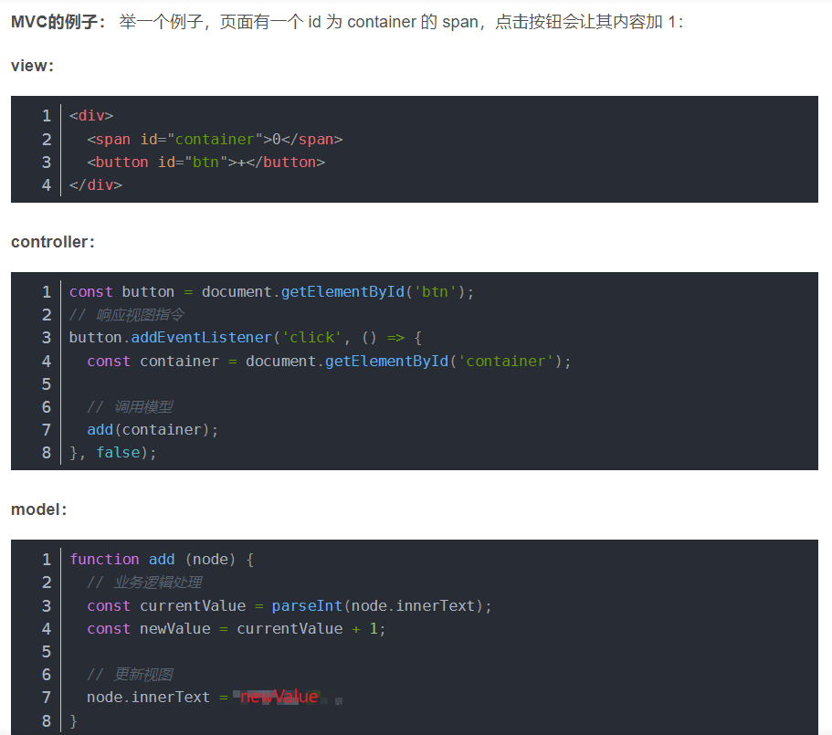

##### 31.vue的响应式原理

##### 32.上次面试的切换类名（有时间试一下用原生的方式写）还有一个利用正则区分密码难度 有三个等级

```vue
 <button @mouseenter="move1" @mouseleave="leave1">奇数</button>
  <button @mouseenter="move2" @mouseleave="leave2">偶数</button>
  <!-- 此处动态添加class类名的方式是对的 -->
  <!-- <div v-for="(item,index) in 6" style="border: 1px solid red;" class="init" :class="`${'div'+index}`">{{ item }}</div> -->
  <!-- 此处添加多个class类名用如下方式 数组    还有一个麻烦的方法就是写多个class，太麻烦，注意有的需要加冒号 -->
  <div v-for="(item,index) in 6"  :class="['init',index%activeIndex1===0?'active':'',index%activeIndex2===1?'active':'']" >{{ item }}</div>


 data() {
    return {
      activeIndex1:0,
      activeIndex2:0,
    };
  },

 move1(){
      this.activeIndex1=2
    },
    leave1(){
      this.activeIndex1=0
    },
    move2(){
   this.activeIndex2=2
    
    },
    leave2(){
      this.activeIndex2=0
    },

<style>
    .init{
  border: 1px solid red;
}

.active{
  /* 这个地方由于切换属性用的行内样式 权重比这里高 所以必须加important */
  /* border: 10px solid black !important; */
  border: 10px solid black !important;
  font-weight: 600;
  color: yellow;
}

</style>
```

##### 33.图片懒加载是怎么实现的？

https://blog.csdn.net/darabiuz/article/details/123151266

首先我们将所有的图片设置一个相同的src，可以是一张相同，内存占用很小的图片，这样就只需要发一次请求，可以获取到所有图片当前的src地址，然后我们给每个图片标签设置自定义属性 data-url （data-url可以换成data-任意），值为此图片真实的路径，然后我们计算出页面 scrollTop 的高度和浏览器的高度之和， 如果图片距离页面顶端的坐标 Y（相对于整个页面，而不是浏览 器窗口）小于前两者之和，就说明图片就要显示出来了（合适的时机，当然也可以是其他情况），这时 候我们再利用dom.dataset.url获取到真正的url ，替换掉对应图片当前默认的地址就实现了图片懒加载

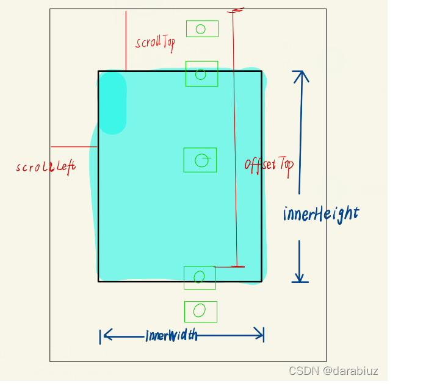

```js
 
    
    
    
    


window.onload = function () {
         //获取到全部的img标签   下面两种方法都可以获取
        // let imgs = document.getElementsByTagName('img')
        var imgs = document.querySelectorAll("img");
        // 初始化执行
        lazyLoad(imgs);
        // 滚动执行
        window.addEventListener("scroll", function () {
          lazyLoad(imgs);
        });
 
        function lazyLoad(imgs) {
          for (let i = 0; i < imgs.length; i++) {
            var imgoffsetT = imgs[i].offsetTop; // 图片的距顶部的高度,这个顶部是浏览器顶部，不是可视区域顶部
            var wheight = window.innerHeight; // 浏览器可视区的高度
            var scrollT = document.documentElement.scrollTop; // 页面被卷去的高度
            if (imgoffsetT - scrollT <= wheight) {
              // 判断图片是否将要出现
                // 下面两种方法都可以
              // imgs[i].src = imgs[i].getAttribute('data-url'); //从dataurl中取出真实的图片地址赋值给url
              imgs[i].src = imgs[i].dataset.src; // 出现后将自定义地址转为真实地址
            }
          }
        }
      };


```

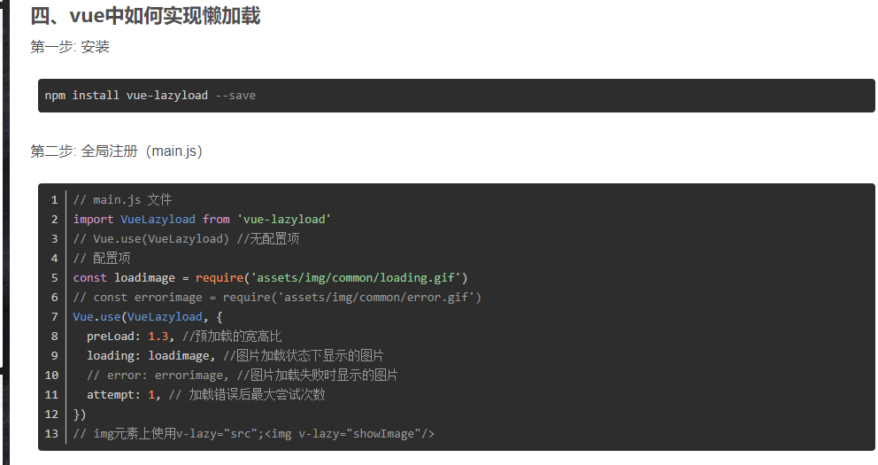

#####  34.for...in 迭代和 for...of 有什么区别

1、 推荐在循环对象属性的时候，使用 for...in,在遍历数组的时候的时候使用for...of。

2、 for in遍历的是数组的索引，而for of遍历的是数组元素值

3、for...of 不能循环普通的对象，而我们可以通过生成器让对象可以被for of使用

```js
var obj = {
    a:1,
    b:2,
    c:3
};

obj[Symbol.iterator] = function(){
	var keys = Object.keys(this);
	var count = 0;
	return {
		next(){
			if(count<keys.length){
				return {value: obj[keys[count++]],done:false};
			}else{
				return {value:undefined,done:true};
			}
		}
	}
};

for(var k of obj){
	console.log(k);//遍历结果是依次是后面三个数组 ['a', 1] ['b', 2] ['c', 3]
}

```

4、for...in 遍历顺序以数字为先 无法遍历 symbol 属性 可以遍历到公有中可枚举的

5、从遍历对象的角度来说，for···in会遍历出来的为对象的key，但for···of会直接报错。

##### 35.构造函数生成实例的执行过程：使用面向对象编程时,new关键字做了什么？

1.新建了一个Object对象

2.修改构造函数this的指向，是其指向新建的Object对象，并且执行构造函数

3.为Object对象添加了一个__proto__属性，是其指向构造函数的prototype属性

4.将这个Object对象返回出去

##### 36.vue虚拟dom

虚拟 DOM（根据模板使用createElement方法生成一个js对象），就是用对象的方式取代真实的 DOM 操作，当页面打开时浏览器会解析 HTML 元素，构建一颗 DOM 树，将这棵dom树状态全部保存起来，在内存当中模拟我们真实的 DOM 操作，操作完后会生成一颗 虚拟dom 树，根据 diff 算法比较两颗 DOM 树不同的地方，只将不同的地方进行重新渲染，通过最小化的dom操作，就实现了高效的渲染和更新元素，避免了直接操作真实dom，引发回流或重绘，从而提高了浏览器的性能。

例如，一个 ul 标签下很多个 li 标签，其中只有一个 li 有变化，这种情况下如果使用新的 ul 去替代旧的 ul,因为这些不必要的 DOM 操作而造成了性能上的浪费，但是如果直接使用虚拟节点覆盖旧节点的话，减少了很多的不必要的 DOM 操作。

缺点：首次渲染大量DOM时，由于多了一层虚拟DOM的计算，会比innerHTML插入慢。


##### 37.diff算法

diff 算法是一种通过同层的树节点进行比较的深度优先算法,比较方式：diff整体策略为：深度优先，同层比较

diff算法 当data发生改变 会根据新的数据生成一个新的虚拟dom ，新的虚拟dom和旧的虚拟dom进行对比，这个对比的过程就是diff算法，会找到不同地方，只去渲染不同的地方，总的来说就是减少DOM，重绘和回流。

详细的对比流程是（是根据新的来排旧的数组，旧的才是我们要的）

首先，我们拿到新旧节点的数组，然后初始化四个指针，分别指向新旧节点的开始位置和结束位置，进行两两对比，（就四种对比方式啊，新开始和旧开始；新结束和旧结束；新开始和旧结束；新结束和旧开始）1.若是 新的开始节点和旧开始节点相同，则都向后面移动指针，2.若是结尾节点相匹配，则都前移指针。3.若是新开始节点和旧结尾节点相同上了，则会将旧的结束节点移动到旧的开始节点前。4.若是旧开始节点和新的结束节点相匹配，则会将旧开始节点移动到旧结束节点的后面。若是上述节点都没配有匹配上，则会进行一个兜底逻辑的判断，判断新的开始节点是否在旧节点中存在，若是存在则复用这个旧节点，若是不存在则在旧的开始节点新建一个这个节点。最后当新的开始节点指针大于新的结束节点，说明对比已经结束，也就说明旧的开始到结束节点之间的节点是新节点中不存在的，删除此时旧开始与旧结束指针之间的节点。vue 的diff算法是个深度优先算法

##### 38.methods与computed区别

1.methods属性内的方法调用可以加括号，而computed属性内的方法调用不能加括号，就和常量的使用一样

2.computed计算属性有缓存，当一个computed在同时在一个页面使用两次，只会调用第一次，第二次用的是缓存，methods没有缓存，需要执行多次。所以计算属性效率更高

3.计算属性是一个属性，必须要有return返回值，methods可有可无

##### 39.watch和computed区别

1.computed支持缓存，相依赖的数据发生改变才会重新计算；watch不支持缓存，只要监听的数据变化就会触发相应操作

2.computed不支持异步，当computed内有异步操作时是无法监听数据变化的；watch支持异步操作

3.是否调用return：computed中的函数必须要用return返回，watch中的函数不是必须要用return。

4.computed的监听是页面初始化的时候就开始的，而watch默认第一次加载不监听，需要自己immediate:true开启才行

4.使用场景：computed----当一个属性受多个属性影响的时候，使用computed-----购物车商品结算。watch–当一条数据影响多条数据的时候，使用watch-----比如搜索框我做的那个地图项目，点击某个区域，仓库中存储的


##### 40.v-if和v-show的区别及使用场景？

1.v-if 动态的创建或者销毁元素；v-show 是控制元素的显示或者隐藏，实际上就是利用display：block，none

2.由于v-if 创建或者销毁元素，有更高的切换消耗，而 v-show 有更高的初始化渲染消耗，一般推荐频繁切换的时候使用 v-show 更好，当切换频率不是特别频繁；或判断分支比较多的时候；以及首次渲染的时候 使用v-if

##### 41.vue中key 的作用 

##### key某些时候不能使用index的原因 https://blog.csdn.net/cun_king/article/details/120714227

key在Vue是DOM对象的标识，也是diff的一种优化策略，可以根据key，更准确， 更快的找到对应的vnode（虚拟）节点，更高效的对比新旧虚拟DOM中每个节点是否是相同节点，相同就复用，不相同就删除旧的创建新的；注意在顺序不变的时候直接使用index作为key是可行的，而顺序发生变化就不要使用index，容易造成渲染错误，因为如果你在首部插入新生成的节点，那么原先的index=0的节点就变成了你新生成的节点，原先index=0的节点的index也跟着改变了，实际上这个节点并没有删除，所有会造成渲染错误；

##### 42.vue的响应式原理

```js
Object.defineProperty怎么用， 三个参数？，有什么作用啊？
     Object.defineProperty() 方法会直接
     vue2响应式的缺点：只能监听对象属性的读取和修改，如果想要删除或增加就无法响应式刷新页面，必须借助this.$set;
通过下标或length修改数组也不会响应式刷新页面，是通过使用pop，push等这几种数组方法操作数组才是响应式的，而数组方法 map 就是
用一种新的思路让新增的数组属性具有响应式,如 map 方法把旧数组返回到一个新数组上,如果你在旧数组添加了这个元素,然后返回给了一个新数组,那么这个元素也具有响应式；在一个对象上定义一个新属性，或者修改一个对象的现有属性，并返回此对象。
     Object.defineProperty(obj, prop, {})
     obj：需要定义属性的对象
     prop：需要定义的属性
     {}：要定义或修改的属性描述符。
     value: "18",         // 设置默认值得
     enumerable: true,    //这一句控制属性可以枚举 enumerable 改为true 就可以参与遍历了   默认值false
     writable: true,      // 控制属性可以被修改   默认值false
     configurable: true,  // 控制属性可以被删除   默认值false
      get // 当有人读取 prop 的时候  get函数就会调用,并且返回就是 sss 的值
      set // 当有人修改 prop 的时候  set函数就会调用, 有个参数这个参数就是修改后的值

      this.$set( target, key, value )
    //target：要更改的数据源(可以是对象或者数组)
    // key：要更改的具体数据
    //value ：重新赋的值

 //vue的删除数组和原生删除数组的区别delete
**删除数组**
1. delete只是把数组元素的值变成empty/undefined，元素的键不变，数组长度不变。
2. Vue.$delete(array,index)直接删除数组，改变数组的键值和长度。是响应式的
**删除对象**
两者相同，都会把键名（属性/字段）和键值删除。但是delete不是响应式的，而this.$delete是响应式的，而在vue3当中，我们直接使用delete删除对象的属性也是响应式的。

```

**42.vue2响应式原理**

vue.js 是采用数据劫持结合发布者-订阅者模式的方式，通过**Object.defineProperty()来劫持各个属性的setter**，**getter**，在数据变动时发布消息给订阅者，触发相应的监听回调。 **具体步骤：** 

**第一步：** 需要 **observe** 的数据对象进行递归遍历，包括子属性对象的属性，都加上 **getter** 和**setter** ，这样的话，给这个对象的某个属性赋值，就会触发 setter，那么就能监听到了数据变化

**第二步：**  **compile 解析模板指令**，将模板中的变量替换成数据，然后初始化渲染页面视图，并将每个指令对应的节点绑定更新函数，添加监听数据的订阅者，一旦数据有变动，收到通知，更新视图

**第三步：**  **Watcher 订阅者是 Observer 和 Compile 之间通信的桥梁**，主要做的事情是: 1、在自身实例化时往属性订阅器(dep)里面添加自己 2、自身必须有一个 **update()** 方法 3、待属性发生变化， **dep.notice()** 通知时，调用自身的 update() 方法，并触发 Compile 中绑定的回调，则功成身退。

第四步（这一步应该不算，不需要记）：MVVM 作为数据绑定的入口，整合 **Observer、Compile 和 Watcher** 三者，通过 Observer 来监听自己的 model 数据变化， 通过 Compile 来解析编译模板指令，最终利用 Watcher 搭起 Observer 和 Compile 之间的通信桥梁，达到数据变化 -> 视图更新； 视图交互变化(input) -> 数据 model 变更的双向绑定效果。

**vue2和vue3响应式原理区别**

在vue2中只能监听对象属性的读取和修改，如果想要删除或增加就无法响应式刷新页面，必须借助this.$set才能添加属性，只能使用this.$delete（）才能响应式删除对象内的属性;通过下标或length修改数组也不会响应式刷新页面，是通过使用pop，push等这几种数组方法操作数组才是响应式的。而在vue3中这些问题都得以解决，vue3是利用Proxy通过Proxy（代理），拦截对象中任意属性的变化，包括：属性值的读写、属性的添加、属性的删除等。通过Reflect（反射）：对被代理对象的属性进行操作。不需要像vue2中需要给每一个对象的属性都添加上监听才能实现响应式，只需要给对象的最顶层添加代理，对象任意层级属性发生变化都可以监听到。

**为什么使用reflect？**

 ECMA正在尝试将Object中很多有用的API,移植到Reflect身上。  例如：Object身上有的Object.defineProperty()，Reflect身上也有，当通过Object.defineProperty()给某个对象属性添加响应式，后面你又给这同一个属性添加了响应式整个代码就会挂掉；用Reflect.defineProperty()去追加属性的时候，即使重名，也不会报错；但是只有第一次追加的值才生效；且Reflect.defineProperty是有返回值的，由于第二次代码是错误的，所有会返回false，方便我们分析错误，而Object.defineProperty()必须借助try catch才可以实现这样的功能

  

##### 43.数据双向绑定的原理（这里我理解的是v-model的原理）

https://blog.csdn.net/Zhang_wang_yun/article/details/131344048


##### 44.vue2和vue3的区别

1.响应式原理发生变化，vue2是利用Object.defineProperty()对数据进⾏劫持 结合 发布订阅模式的⽅式来实现的；vue3 中使⽤了 ES6 的 ProxyAPI 对数据代理，通过 reactive() 函数给每⼀个对象都包⼀层 Proxy，通过 Proxy 监听属性的变化，从⽽ 实现对数据的监控。

2.Vue2使用 选项式API（Options API）；当一个数据发生变化，需要在data，method。computed当中依次去修改代码； Vue3 组合式API（Composition API）中将数据和方法都定义在了setup里面，修改更方便，更加的贴近于模块化

3.vue2中每一个组件必须有一个根标签，而vue3中不需要有根标签，有利于减少内存

4.生命周期发生变化

创建前：beforeCreate -> 使用setup()
创建后：created -> 使用setup()
挂载前：beforeMount -> onBeforeMount
挂载后：mounted -> onMounted
更新前：beforeUpdate -> onBeforeUpdate
更新后：updated -> onUpdated
销毁前：beforeDestroy -> onBeforeUnmount
销毁后：destroyed -> onUnmounted
异常捕获：errorCaptured -> onErrorCaptured
被激活：onActivated 被包含在<keep-alive>中的组件，会多出两个生命周期钩子函数。被激活时执行。
切换：onDeactivated 比如从 A 组件，切换到 B 组件，A 组件消失时执行
5.vue3中对typescript的支持比vue2好的多

6.重写虚拟 DOM ，随着虚拟 DOM 重写，减少 运行时（runtime）开销。将包括更有效的代码来创建虚拟节点。


##### 45.vue生命周期

beforeCreate() 创建前，这个时候data中的数据，还未定义，所以不能使用
created()创建后 最早开始访问到 data和methods，computed，watch中数据或方法的生命周期钩子，在此时我们就可以发起ajax请求

beforeMount()挂载前 指令已经解析完毕，内存中已经生成dom树，但是尚未挂载到页面中去，此时页面还是旧的。
mounted()挂载后 dom已经渲染完毕，此时页面和内存中都是最新的数据，现在就可以操作DOM元素

 beforeUpdate()更新前 当视图层的数据发生改变会执行这个钩子 内存中数据已经更新，但是DOM节点还未更新，数据还没有与页面同步
 updated()更新后 数据更新完成以后触发的钩子，此时DOM节点已经更新

 beforeDestroy()即将销毁 data和methods中的数据此时还是可以使用的，可以做一些释放内存的操作，比如销毁定时器，解绑全局事件，移除监听事件等
 destroyed()销毁完毕  组件已经全部销毁，Vue实例已经被销毁，Vue中的任何数据都不可用

 其他三个：

keep-alive的大致用法，再次回到该页面的时候使用的是缓存：https://blog.csdn.net/code_dream_wq/article/details/128713825     

activated  被 keep-alive 缓存的组件激活时调用。组件初始化时不会被调用，因为第一次使用的不是缓存，第二次访问这个路由才会被调用，和上面的生命周期钩子一样使用方法
deactivated 被 keep-alive 缓存的组件停用时调用，当离开缓存的路由组件时被调用。

errorCaptured 当捕获一个来自子孙组件的错误时被调用，此钩子会收到三个参数：错误对象、发生错误的组件实例以及一个包含错误来源信息的字符串。此钩子可以返回 false 以阻止该错误继续向上传播

##### 常见的组件通信方式（下面这篇文章总结很到位）

https://blog.csdn.net/qq_54753561/article/details/122281196

.sync（子组件用props接收传递过来的属性）

```js
//父组件
 <div class="">
     //这里的这个v-bind:value1的这个value1可以任意取值，在子组件中props引入时的名字需要和这个一致
    <Ceshi :value1.sync="val"></Ceshi>
    {{ val }}
  </div>

<script>
import Ceshi from './components/Ceshi.vue'
export default {
  name:'App',
  data() {
    return {
      val: "我是Home里的数据 响应式的",
    };
  },
  components:{Ceshi},
};
</script>

//子组件
<template>
    <input class="i911-sync" :value="value1" @input="handleInput" />
  </template>
  <script>
  export default {
    name: "Ceshi",
    props: {
      value1: {
        type: String,
        default: "",
      },
    },
    methods: {
      handleInput(event) {
          //这个更新函数形式是固定的update:后面跟的是你props引入的那个值的属性名，不是固定说必须用value
        this.$emit("update:value1", event.target.value);
        console.log(this.$props)
      },
    },
  };
  </script>

```


##### 46.rem和em的区别

1.em是相对长度单位，比px更具灵活性，em的长度是相对于父元素

2.rem的长度是相对于根元素，也就是html的字体大小


##### 47.跨域

**JSONP的基本原理是利用`<script>`标签的`src`属性没有跨域限制的特性来实现跨域数据访问。** 在使用JSONP时，需要在客户端创建一个`script`标签，将需要访问的资源URL以参数形式通过script标签的src传递给服务器，服务器在接收到请求后，将数据装入一个函数调用中返回给客户端，这个函数就是在客户端预先定义好的回调函数。缺点是只有jsonp只支持get请求，不支持post等其他http请求；由于jsonp请求是通过script标签实现，所以我们无法设置请求头，也无法获取响应头。

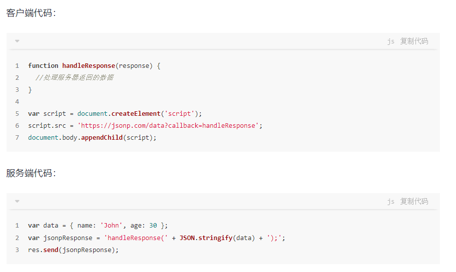

代理跨域

https://blog.csdn.net/marendu/article/details/103733286

由于同源协议会导致跨域，代理跨域就是利用服务器和服务器之间不存在跨域问题，配置一个代理服务器，让代理服务器向服务器发请求，服务器收到请求并返回结果给代理服务器，然后代理服务器再将请求结果返回给我们真正需要用到的地方。

```js
//  cli3     vue.config.js
  devServer: {
    proxy:{
      "/api": {
          target: "http://www.xiongmaoyouxuan.com", // 需要代理的域名
           ws: false, // 是否启用websockets
          changeOrigin: true, //允许跨域 可以代理反向的地址，在生产环境当中可以不设置，当设置为true，请求头中的origin属性会被改变为目标服务器的地址，以避免跨域问题
          pathRewrite: {  //重写匹配的字段，重写为""，让服务器收到的是你真正发起请求的那个字段
              "^/api": ""
          }
      },
  },
  }

//然后在创建axios的时候，beseURL这样如下配置，这个baseUrl的作用就是在你使用下面这个axios的时候 所有端口号后字段添加/api这个字段
const ajax = axios.create({
    baseURL:"/api",
})
//当我们碰到/api开头的请求地址，就会知道这个地址需要代理跨域
```

##### 48.什么是ajax？ajax有什么优缺点？

ajax不是语言，ajax是一种在无需重新加载整个网页的情况下，能够更新部分网页的技术

优点

1、最大的一点是页面无刷新，用户的体验非常好。

2、使用异步方式与服务器通信，具有更加迅速的响应能力。

缺点

1、ajax不支持浏览器back按钮。

3、对搜索引擎的支持比较弱。

4、破坏了程序的异常机制。

5、不容易调试

```js
//1.创建xhr 核心对象
var xhr=new XMLHttpRequest();

//2.调用open 准备发送
//参数一：请求方式
//参数二: 请求地址
//参数三：true异步，false 同步
xhr.open('post','http://www.baidu.com/api/search',true)

//3.如果是post请求，必须设置请求头。
xhr.setRequestHeader('Content-Type', 'application/x-www-form-urlencoded')

//4.调用send 发送请求 （如果不需要参数，就写null）
xhr.send('user=tom&age=10&sex=女')

//5.监听异步回调 onreadystatechange
//判断readyState 为4 表示请求完成
//判断status 状态码 为 200 表示接口请求成功
//responeseText 为相应数据。字符串类型。
xhr.onreadystatechange=function(){
    if(xhr.readyState==4){ 
        if(xhr.status==200){
            console.log(xhr.responseText);
            var res=JSON.parse(xhr.responseText);
            console.log(res);
            if(res.code==1){
            modal.modal('hide');
           location.reload();
       }
    }
            
            
//备注：如果是post请求，想要传json格式数据。
//设置请求头

xhr.setRequestHeader('Content-Type', 'application/json')

//open发送数据
xhr.open({_id:xxx,user:xxxx,age:xxxx})
```


##### 49.axios

Axios是一个基于[promise](https://so.csdn.net/so/search?q=promise&spm=1001.2101.3001.7020)的HTTP库，类似于jQuery的ajax，用于发起http请求，也支持promise的一些用法。

可以和面试官讲用法，比如我们在做项目的时候一般会对axios进行二次封装，方便我们复用，首先我们利用axios.create（）创建axios的实例，然后配置baseURL以及timeout，最长响应时间。然后可以配置请求拦截器，然后可以设置登录的判断，如果存在token，就讲token配置到请求头上，因为有一些接口我们设置有需要token的请求头；我们还可以设置比如请求加载的进度条,然后添加一个当提示有错误信息的配置项即可；然后在响应拦截器中配置当状态码为200和20000的时候为请求成功；其他为失败，并打印出失败的结果，然后我们就可以在统一配置请求接口的地方利用这个axios发起http请求。而且还有如axios.all这个有promise.all封装来的可以实现并发处理请求的方法，可以实现同时发起多个请求，并等待全部请求结果返回之后同时处理请求结果的业务。

```js
// 引入进度条
import nprogress from "nprogress"
// 光引入进度条没用 显示不出进度条 还要引入进度条样式
import "nprogress/nprogress.css"

let instance = axios.create({ });
instance.interceptors.request.use(config=>{ 
    //token存在就配置请求头
     if (store.getters.token) {
      config.headers.token = getToken()
    }
    //开始进度条  ，需要在响应拦截器中去配置停止进度条
     nprogress.start()
    return config,
    (err) => { 
        // 在请求错误的时候的逻辑处理
        return Promise.reject(err);
      }

})
```

```js
//响应拦截器
service.interceptors.response.use(response => {
    const res = response.data
    // console.log(res)
    // 服务器响应失败再干什么  这里为什么20000和200都要加上 因为这里mock数据成功code是20000，真实接口成功回调code是200
    if (res.code !== 20000 && res.code !== 200) {
      Message({
        message: res.message || 'Error',
        type: 'error',
        duration: 5 * 1000
      })

      // 50008: Illegal token; 50012: Other clients logged in; 50014: Token expired;
      if (res.code === 50008 || res.code === 50012 || res.code === 50014) {
        // to re-login
        MessageBox.confirm('You have been logged out, you can cancel to stay on this page, or log in again', 'Confirm logout', {
          confirmButtonText: 'Re-Login',
          cancelButtonText: 'Cancel',
          type: 'warning'
        }).then(() => {
          store.dispatch('user/resetToken').then(() => {
            location.reload()
          })
        })
      }
      return Promise.reject(new Error(res.message || 'Error'))
      // 服务器响应成功干什么
    }
    else {
      return res
    }
  },
  error => {
    console.log('err' + error) // for debug
    Message({
      message: error.message,
      type: 'error',
      duration: 5 * 1000
    })
    return Promise.reject(error)
  }
)
```

##### 50.promise

1、Promise 是异步编程的一种解决方案，主要用于异步计算，支持链式调用，可以解决回调地狱 的问题，自己身上有all、reject、resolve、race 等方法；

2、可以将异步操作队列化，按照期望的顺序执行，返回符合预期的结果，可以在对象之间传递和操作 promise，帮助我们处理队列

3、promise 有三个状态：pending[待定]初始状态，fulfilled[实现]操作成功，rejected[被否决]操作失败

4、Promise 对象状态改变：从pending变为fulfilled和从pending变为rejected。只要这两种情况发生，状态就凝固了，不会再变了

5、如果不设置回调函数，Promise内部抛出的错误，不会反应到外部，但是写了then 和 catch ，会被then的第二个参数 或 catch所捕获

```js
//回调地狱就是回调函数嵌套回调函数，然后上一个回调函数请求回来的结果需要作为这一个请求的参数；如果嵌套多了，就是回调地狱。
<script>
        //通过ajax请求拿到用户id
        $.ajax({
            type:"GET",
            url:"./data1.json",
            success:function(res){
                let {id} = res;
                console.log(id);

                //通过用户id找到用户名
                $.ajax({
                    type:"get",
                    url:'./data2.json',
                    data:{id},
                    success:function(res){
                        let {username} = res;
                        console.log(username);

                        //通过用户名找到用户邮箱
                        $.ajax({
                            type:"GET",
                            url:"./data3.json",
                            data:{username},
                            success:function(res){
                                let {email} = res;
                                console.log(email);
                            }
                        })
                    }
                })
            }
        })
    </script>

//利用promise解决，封装成一个函数
//封装Ajax请求函数
function getAjax(path,data){
   return new Promise((resolve,reject)=>{
        $.ajax({
            type:'get',
            url:path,
            data:{data},
            success:function(res){
                resolve(res)
            },
            error:function(res){
                reject(res)
            }
        })
    })
}

getAjax('./data1.json')
.then((value)=>{
    let id = {value};
    return getAjax("./data2.json",id)
})
.then((value)=>{
    let {username} = value;
    return getAjax('./data3.json',username)
})
.then((value)=>{
    console.log(value);
})


```

`Promise.all(promises)` —— 等待所有 promise 都 resolve 时，返回存放它们结果的数组。如果给定的任意一个 promise 为 reject，那么它就会变成 `Promise.all` 的 error，所有其他 promise 的结果都会被忽略

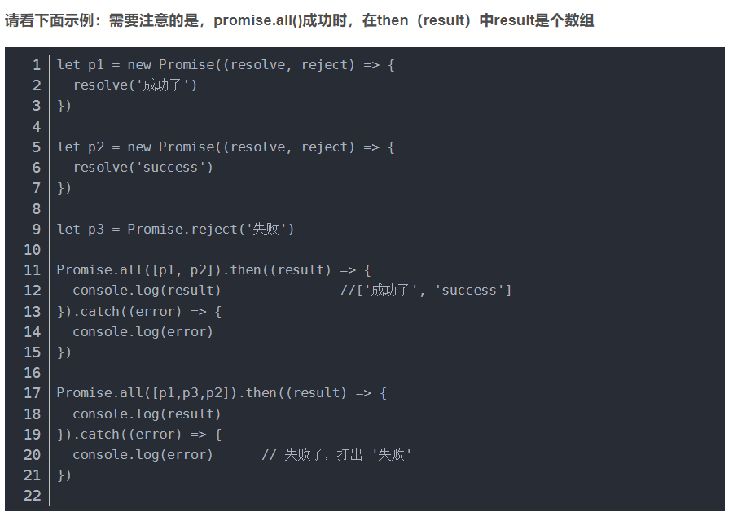

`Promise.race(promises)` —— 等待第一个 settle 的 promise，并将其 result/error 作为结果返回。

`Promise.resolve(value)` —— 使用给定 value 创建一个 resolved 的 promise。实际上是new Promise(resolve => resolve());


`Promise.reject(error)` —— 使用给定 error 创建一个 rejected 的 promise。

原型上有then、catch等方法。

promise.finally方法：无论成功还是失败，都会执行

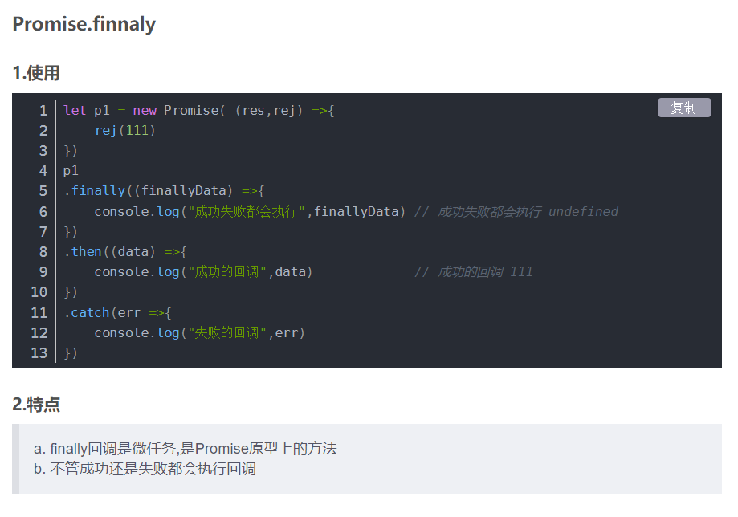

##### 51.async，await（这篇文章讲的还行可以看看）

https://blog.csdn.net/weixin_45811256/article/details/123638582

async，await是异步编程的最终解决方式，让异步代码看着像是同步代码。

1.`await`必须写在`async`函数中, 但async函数中可以没有await
2。如果await的promise失败了, 就会抛出异常, 需要通过`**try…catch**`来捕获处理。所以如果只有一个异步请求的时候，直接用promise比用async，await反而更加的方便，而如果是多个异步请求，那当然用async，await好一些，await 能够获取promise执行的结果 await必须和async一起使用才行，async配合await使用是一个阻塞的异步方法

如果await后面不是Promise对象, 就直接返回对应的值，只能在async函数中出现, 普通函数直接使用会报错

await语句后的Promise对象变成reject状态时，那么整个async函数会中断，后面的程序不会继续执行


await后面的代码还是要执行的，根据情况判断，同步执行，异步放入微任务或红任务队列，而不是全部延后执行，await下面的代码才是被阻塞的代码，当await的代码执行完之后先执行函数外部的代码，同步执行，异步放入队列，最后在执行被阻塞的代码

```js
  async function async1() {
    console.log('async1 start')
    await async2()
    console.log('async1 end')
    setTimeout(() => {
      console.log('timer1')
    }, 0)
  }
  async function async2() {
    setTimeout(() => {
      console.log('timer2')
    }, 0)
    console.log('async2')
  }
  async1()
  setTimeout(() => {
    console.log('timer3')
  }, 0)
  console.log('start')
// async1 start => async2 => start => async1 end => timer2 => timer3 => timer1


// 注意：如果async函数中有返回值，当调用该函数时，内部会调用Promise.resolve()方法把它转化成一个promise对象作为返回；如果没用返回值，那么timeout()这个promise的结果为undefined

async function timeout() {
      return 'hello world!'
    }
//timeout()返回的就是一个promise，状态为已完成，结果为hello world，所以这个函数调用可以使用then接收
    timeout().then(val => {
      console.log(val)
    })
    console.log('我虽然在后面，但是先执行')

```

##### 52.常用的数组方法

forEach

map

indexOf  

splice  在指定元素前删除或新增数组元素

join

flat

from  将可迭代伪数组转化为真数组

reduce  累加

数组去重方法

every  全部被包含就为true

some 只要有一个就true

find  

filter

##### 53.对象的继承方式

**1.原型链继承：将父类的实例作为子类的原型**

优点：父类方法可以复用

缺点：

1. 父类的所有引用数据类型如对象会被所有子类共享，当给A子类的引用属性增删改查的时候，B子类使用这个对象的时候也会同步，这里我明白为什么，还是引用的是数据的地址导致的,基本数据类型不存在这种影响。
2. 子类型实例不能给父类型构造函数传参

```js
function Parent() {
            this.isShow = true
            this.info = {
                name: "yhd",
                age: 18,
            }
        }

        Parent.prototype.getInfo = function () {
            console.log(this.info)
            console.log(this.isShow) // true
        }

        function Child() { };
        Child.prototype = new Parent()

        let Child1 = new Child()
        Child1.info.gender = "男"

        let child2 = new Child()
        child2.info.hobby = '篮球'
        Child1.getInfo()  // {name: "yhd", age: 18, gender: "男",hobby: '篮球'}
        child2.getInfo()  // {name: "yhd", age: 18, gender: "男",hobby: '篮球'}
        child2.isShow = false

        console.log(child2.isShow) // false
        console.log(Child1.isShow)//true
```

2.构造函数继承

原理：由于构造函数的this指向他的实例对象，所以当他的实例对象调用构造函数的某个this.属性的时候可以拿到；我们就利用call或apply将构造函数A的this指向另外一个B构造函数的实例对象，那么那个实例对象也就能通过this访问到构造函数A的属性了

优点：解决了原型链继承不能传参和子实例对象之间引用数据类型数据关联的问题，之所以能解决引用数据类型的问题，因为构造函数的this指向实例对象，而子类的两个实例对象this肯定就是不同的啊。

缺点：在父类型的原型中定义的方法，子类型是访问不到的，方法都只能在构造函数中定义，因此无法原型链上函数在不同子类型上复用。

```js
function Parent(name) {
    this.info = { name: name };
}
function Child(name) {
    //继承自Parent，并传参
    Parent.call(this, name);
    
     //实例属性
    this.age = 18
}
Parent.prototype.fun = function () {
            console.log(111111)
        }

let child1 = new Child("yhd");
console.log(child1.info); // {name: 'yhd'}


let child2 = new Child("wxb");
console.log(child2.info); // {name: 'wxb'}


```

3.组合继承

将 `原型链` 和 `借用构造函数` 的组合到一块。使用原型链实现对原型属性和方法的继承，而通过借用构造函数来实现对实例属性的继承。这样，既通过在原型上定义方法实现了函数复用，又能够保证每个实例都有自己的属性，而不是共享引用数据类型如obj

缺点：无论在什么情况下，都会调用两次父类型构造函数：一次是在创建子类型原型的时候，另一次是在子类型构造函数内部

```js
function Person(gender) {
  console.log('执行次数');
  this.info = {
    name: "mjy",
    age: 19,
    gender: gender
  }
}
 
Person.prototype.getInfo = function () {   // 使用原型链继承原型上的属性和方法
  console.log(this.info.name, this.info.age)
}
 
function Child(gender) {
  Person.call(this, gender) // 使用构造函数法传递参数
}
 
Child.prototype = new Person()
 
let child1 = new Child('男');
child1.info.nickname = 'xiaoma'
child1.getInfo()
console.log(child1.info);//{name: 'mjy', age: 19, gender: '男', nickname: 'xiaoma'}
 
let child2 = new Child('女');
console.log(child2.info);//{name: 'mjy', age: 19, gender: '女'}
```

4.原型式继承

看代码就能明白 ，在一个函数A内部创建一个临时性的构造函数，然后将传入的对象作为这个构造函数的原型，最后return 返回这个构造函数的一个实例对象。

优点：不需要再创建子构造函数

缺点：引用数据类型会在多个子类型之间共享

```js
//方法1

function createObject(obj) {
  function Fun() {}
  Fun.prototype = obj
  return new Fun()
}
 
let person = {
  name: 'mjy',
  age: 18,
  hoby: ['唱', '跳'],
  showName() {
    console.log('my name is:', this.name)
  }
}
 
let child1 = createObject(person)
child1.name = 'xxxy'
child1.hoby.push('rap')
let child2 = createObject(person)
 
console.log(child1)
console.log(child2)
console.log(person.hoby) // ['唱', '跳', 'rap']

//方法2，Object.create()，本质就是将上面的函数封装到了这个方法里面，在只有一个参数时，Object.create()与上方的函数方法效果相同。

let child1 = Object.create(person)//和上面的let child1 = createObject(person)是一样的
```

5.寄生类继承

优点：也是不需要给子类型创建构造函数

缺点：父原型对象上的对象在多个子类型上是共享的，在对象上定义的函数无法复用(这一点有点不是很明白)

```js
  function objectCopy(obj) {
            function Fun() { };
            Fun.prototype = obj
            return new Fun()
        }

        function createAnother(obj) {
            let clone = objectCopy(obj)
            //这里相当于给实例对象身上添加一个属性，属性值为一个函数，所以这个函数的this当然指向的就是调用它的这个对象
            clone.showName = function () {
                console.log('my name is：', this)
            }
            return clone
        }

        let person = {
            name: "mjy",
            age: 18,
            hoby: ['唱', '跳']
        }

        let child1 = createAnother(person) //child1就是一个实例对象，也就是对象，在child1身上添加的属性，当然就是对象的属性，也可以说是实例成员
        console.log(child1)
        child1.a = 1 //直接给child1这个对象添加一个属性a，值为1
        console.log(child1.__proto__.age = 19) //这里我理解错了，当直接给child1.age=19，那么是给child1这个对象身上添加了一个age属性值为19，而不是拿到他原型对象上的age去修改值
        child1.hoby.push("rap") //这里是给child1的对象原型上的hoby数组添加了属性，所以下方的child2也会共享到
        child1.showName()
        let child2 = createAnother(person)
        child2.showName()
```

6.寄生组合式继承：这种直接不看了，代码太复杂了，目前我看不懂

##### 7.es6的Class继承（顺带讲一下class）

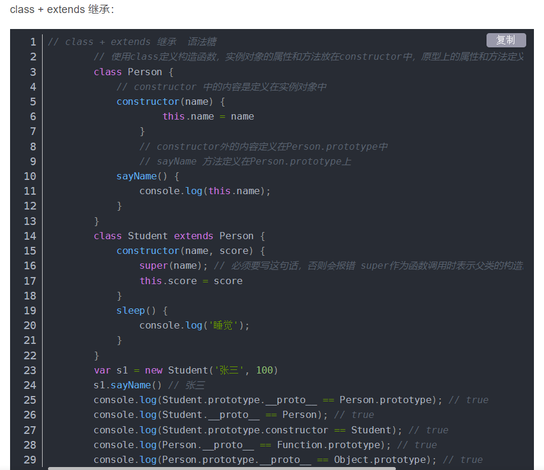

https://blog.csdn.net/weixin_44784401/article/details/128903221   没有讲到super这些，

写在constructor{}外的方法，在class中默认会当成是这个class类的原型对象上的方法

类的所有实例共享一个原型对象，说白了就是构造函数继承

clss本质上就是构造函数的语法糖

```js
// 由下面的例子，看p0和p1就知道了，其实这两个生成的数据是一摸一样的，不会因为一个是对象赋值，一个是实例对象生成而有什么不同，所以可以得出结论，构造函数在class中就是简化了我们给对象赋值的过程，减少了代码量而已。

//且注意，preson和Person2这两种写法利用new生成的实例对象一摸一样，原姓对象上的方法也一摸一样

class Person{
 // 每new一个对象后都会执行这个函数
  constructor(name, age, gender){
    this.name = name;
    this.age = age;
    this.gender = gender;
  }
    //写在constructor之外的方法会被当作这个class类的原型对象上的方法
     toString() {
     return '(' + this.x + ', ' + this.y + ')';
   }
}
function Person2(name, age, gender){
 // 每new一个对象后都会执行这个函数
    this.name = name;
    this.age = age;
    this.gender = gender;
}
Person2.prototype.toString = function () {
   return '(' + this.x + ', ' + this.y + ')';
 };


// 不使用构造函数
let p0 = new Person();
p0.name= '李四';
p0.age= 19;
p0.gender= '男';
console.log(p0); // object

// 使用构造函数
let p1 = new Person('李四', 19, '男');
console.log(p1); // object


```


##### 54.父子组件的声明周期执行顺序

https://blog.csdn.net/m0_73490373/article/details/132010940

##### 55.mxins（注意，如果和组件内属性或方法重名，优先用组件本身的）

https://blog.csdn.net/qq_41809113/article/details/121912330

混入就是创建一些可以复用的方法，供其他组件使用，混入可以全局混入，但是一般不推荐使用；一般使用的混入就是局部混入如下先创建混入，然后导出

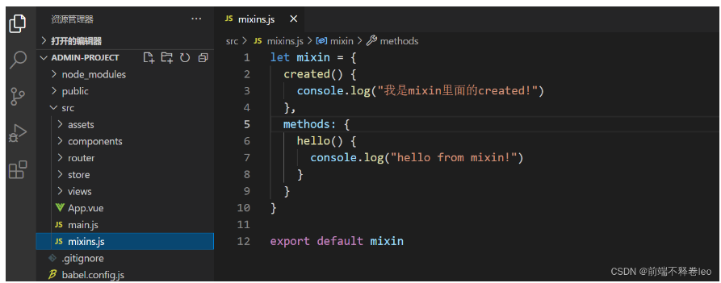

然后在需要使用的组件引入，即可使用

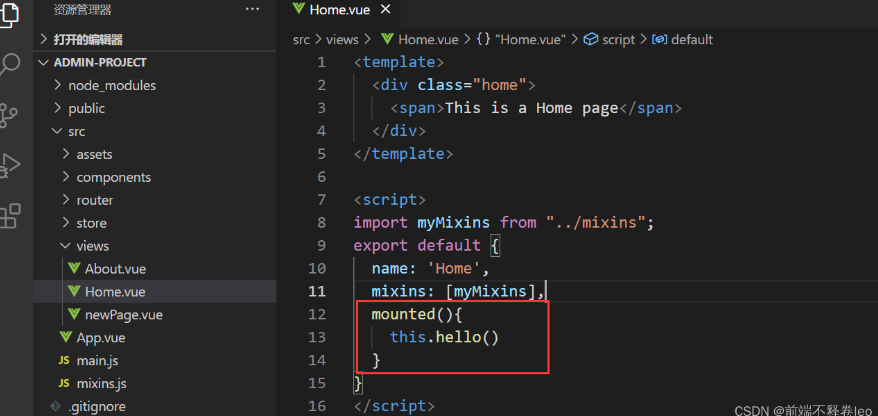

56.路由

57.store仓库

##### 58.自定义指令

https://blog.csdn.net/m0_64346035/article/details/125317756

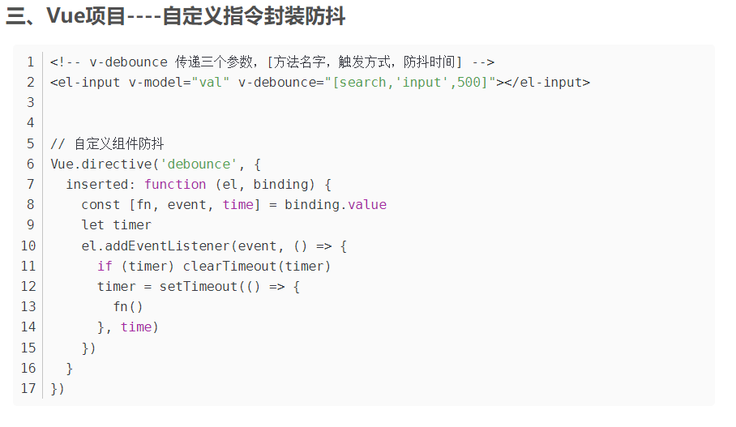

##### 59.nexttick

https://blog.csdn.net/z1902737007/article/details/103769201

this.$nextTick的作用就是可以在dom更新后调用自身的回调，

用处：

1.是我们可以在creacted操作dom，虽然此时dom都没有挂载，页面还是旧的，以及虽然vue不赞成我们直接操作dom，但是有时候我们依然需要直接操作dom。

2.就是点击之后自动聚焦，比如我前段时间做的面包屑利用v-if切换，存在元素的新建和销毁，当从div标签切换到输入框需要自动聚焦，就需要用到nexttick，不然无法自动聚焦

Vue在观察到数据变化时并不是直接更新DOM，而是开启一个队列，并缓冲在同一个事件循环中发生的所有数据改变，当所有的更新完毕之后才更新dom。在缓冲时会去除重复数据（就是如果你执行for循环改变了一百次一个元素，dom去重只获取最后一次的变化），从而避免不必要的计算和DOM操作，以及页面的回流和重绘。Vue会根据当前浏览器环境优先使用原生的Promise.then和MutationObserver，如果都不支持，就会采用setTimeout代替。

```js
//这里我由一个疑惑，如果此处这个div标签内我放的是一个{{value}}，这个value是我在data声明的，当这个标签显现我给这个value赋一个新的值，拿到的是新的那个值吗，我觉得应该是
<div id="app">
<div id="div1" v-if="showDiv">这是一段文本</div>
    <button @click="getText">获取div内容</button>
</div>
<script>
var app = new Vue({
    el : "#app",
    data:{
        showDiv : false
    },
    methods:{
        getText:function(){
            this.showDiv = true;
            this.$nextTick(function(){
                //此处直接操作dom很明显，不使用nexttick获取到的就是更新前的元素内容
                
                  var text = document.getElementById('div1').innnerHTML;
                 console.log(text);  
            });
        }
    }
})
</script>

```


##### 60.v-if和v-for的优先级

很好理解，vue2到vue3肯定是要进步的，所以vue2是v-for优先，因为然后当全部节点生成之后再去if判断删除掉为false的节点，不如先v-if节约性能

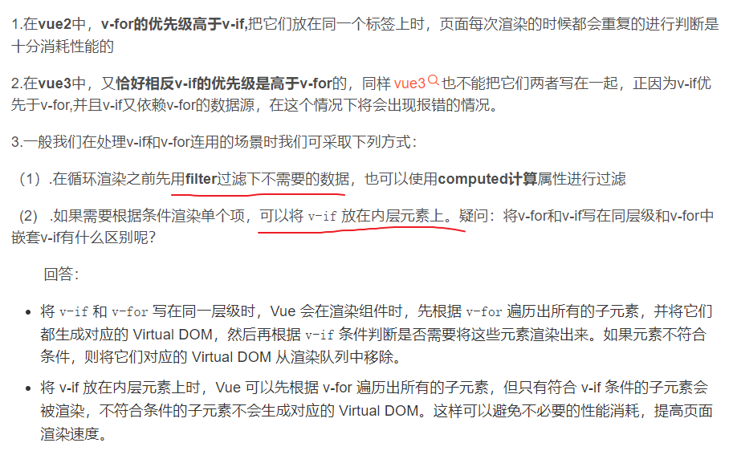

61.过滤器（vue3已经删除 随便看看即可）


##### 62.v-text和{{}}和v-html区别

1.v-text和{{}}表达式渲染数据，不解析标签，如果有标签则直接当做字符输出到页面上。

2.v-html不仅可以渲染数据，而且可以解析标签。

##### 63.scoped和/deep/穿透；或::v-deep

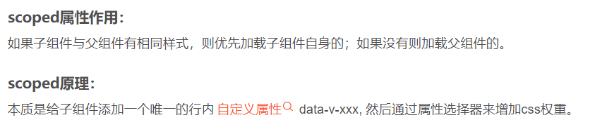

##### 64.js的几种模块规范

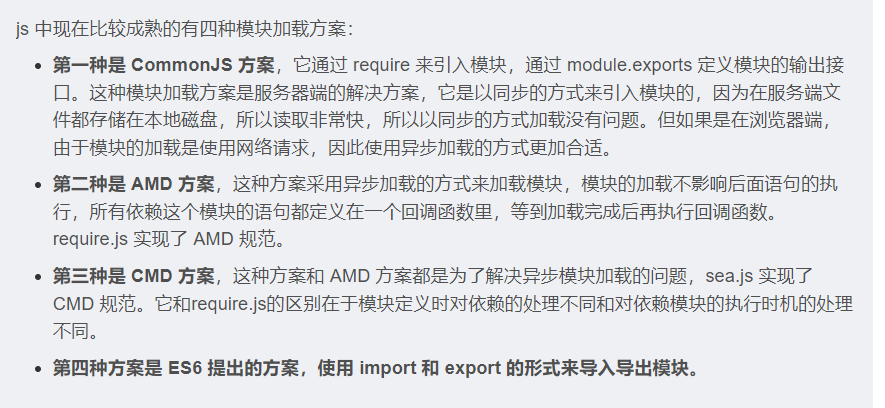


##### 65.预处理器less和sass

css预处理器是用一种专门的编程语言，为CSS增加了一些编程的特性，将CSS作为目标生成文件，然后开发者就只要使用这种语言进行编码工作，可以让你的CSS更加简洁、适应性更强、可读性更佳，更易于代码的维护等诸多好处。

**sass和less**

Sass是一种基于Ruby的CSS预处理器，它可以扩展CSS语言，并添加许多其他功能，如变量、嵌套规则、Mixin、函数等。Sass文件以“.scss”扩展名保存，使用缩进的语法代替css的大括号和分号；并不是特别被开发者接受；而Scss其实就是sass3引入的一种语法格式，对以前的sass进行改进，和css的规范一样使用花括号和分号进行分隔，所以scss更常用。

**less**

Less是一种基于JavaScript的CSS预处理器，它与Sass和Scss有很多相似之处，但它使用类似CSS的语法，比sass更容易学习和使用。Less支持变量、Mixin、嵌套规则等功能，并且可以在客户端和服务器端使用，且编译速度比sass更快

1.使用变量：

```js
//Less定义变量： 
@color: #4D926F;
 
header {
color: @color;
}
 
//Sass定义变量
$blue : #1875e7;　
 
div {
　color : $blue;
}
// 如果变量需要镶嵌在字符串之中，就必须需要写在#{}之中。下面就是设置左边框圆角
$side : left;
.rounded {
　　border-#{$side}-radius: 5px;
}
```

2.混合(Mixins)：Less中使用混合时类似于函数用法，只需在classB中根据classA的命名来使用；Sass中首先在定义混合时需要使用@mixin命令，其次在调用时需要使用@include命令来引入之前定义的混合。

```js
//Less中的混合： @radius: 5px为你设定的默认值，你不传参就使用默认值，可以不使用括号调用，但是为了更好区分，所以一般加上调用.corners()；记住混入可以不带参数，那么定义混入就是.corners{}  在别的地方使用就如header标签  header{.corners}即可
.corners (@radius: 5px) 
{     
    -webkit-border-radius: @radius; 
    -moz-border-radius: @radius; 
    -ms-border-radius: @radius; 
    -o-border-radius: @radius; 
    border-radius: @radius; 
}
 
header {
.corners();//.corners；也可以，只是不容易辨别出来使混入
}
 
footer {
    //这里的10px相当于使传参
.corners(10px);
}
 
//Sass中的混合：    如果不传默认参数，就可以不写()直接写成@mixin left   调用就最直接　@include left
@mixin left($value: 10px) { 　　　　
    float: left; 　　　　
    margin-right: $value; 　　
}
 
div {
　　　　@include left(20px);
　　}
 

```

3.嵌套：

class中嵌套class，从而减少代码的重复。

```js
// 在嵌套的代码块内，可以使用&引用父元素。less和sass都是用&,比如a:hover伪类，可以写成
a {
　　&:hover { color: #ffb3ff; }
}
```

4.运算：

提供了加减乘除四则运算，可以做属性值可颜色的运算。

```js
//这里是less进行四则运算，sass就是将@换成$即可
@margin: 10px;

.button {
  margin: @margin * 2;
    top: 50px + 100px
}

```

5.继承：如果b选择器需要继承a选择器

```js
.a {
　　border: 1px solid #ddd;
}
.b {
　　@extend .class1;
　　font-size:120%;
}
```

6.sass还可以使用if 或if...else或for循环，while循环，each循环；这些是less没有的

7.引入，假如有一个sass文件名为 aaa.scss  我们就可以利用@improt "aaa.scss"引入，less也是同样引入方式，然后就可以在当前的html文件下使用别的sass或less中定义的如变量或者混入。

##### 66.对ts的泛型和接口的了解

##### 67.有哪些设计模式；

##### 68.路由router

##### 69.vuex仓库

直接看这个笔记里面的vuex不会回顾就行了

1.getters其实也是有作用的，假如你想不经过任何条件触发获取到state的数据，比如我做的那个地图，原本我是监听返回的state的数据，相当于直接操作了state，我可以利用getter拿到state，然后我监听这个getter方法也可实现，这就是getter的用法，还是有用的

2.action 主要是可以干一些异步操作，比如发起http请求获取到数据，但是不能通过action直接改变state，在组件中利用的是dispatch获取

3.mutation就是可以唯一可以修改state数据的地方，利用的是commit在组件中，getter不能修改

4.mapActions与mapMutations在methods中利用...使用，且数组形式可以简写，而对象形式不能简写，mapState，mapGetters在computed中使用如...mapMutation:['a'] ,这个a函数的参数我们直接在如点击事件调用a方法的时候传递如@click='a(n)'   ,并且这些语法糖都需要在用到组件中利用vuex引入。开启命名空间后引入方式发生变化，如countStore和personStore两个仓库	...mapMutations('countStore',{increment:'increment',decrement:'decrement'}),

...mapMutations('countStore',['increment','decrement'])等价；

不使用语法糖this.$store.commit('personStore/ADD_PERSON',personObj)；

​                        this.$store.state.countStore.sum   

注意state和其他的开启命名空间引入方式不一样

5.当你在不同模块中namespaced:true,可以开启命名空间，然后就可以模块化vuex仓库

```js
//引入Vue核心库
import Vue from 'vue'
//引入Vuex
import Vuex from 'vuex'
//引入count仓库内容
import countOptions from './count'
//引入person内容
import personOptions from './person'
//应用Vuex插件
Vue.use(Vuex)
   
//创建并暴露store
export default new Vuex.Store({
    modules:{
        //这里键值对一致可以缩写
        countAbout:countOptions,
        personAbout:personOptions,
    }
})

```

https://blog.csdn.net/qq_55593227/article/details/119717498

##### 70.正则表达式（看看常见的即可）

##### 71.关于cookie的一些细节

##### 72.vue首屏加载过慢出现白屏的解决情况

1.使用路由懒加载的方式，通过import来实现路由的动态加载，这属于减少加载模块的优化

```js
{
     path: '/goodList',	//path路径	
     name: 'goodList',	//组件名
     component: () => import('../components/goodList')
},
```

2.图片懒加载，在vue中使用vue-lazyload实现，这属于减少请求次数或体积的优化。

使用精灵图的方式减少小图标总请求数也算小的优化

```js
// 下载依赖  npm install vue-lazyload --save

//main.js 文件
import VueLazyload from 'vue-lazyload'	//引入依赖
Vue.use(VueLazyload)
// 配置项
Vue.use(VueLazyload, {
  preLoad: 1.3,	//表示lazyload的元素,距离页面底部距离的百分比.计算值为(preload - 1)，默认值为1.3
  error: 'dist/error.png',	//加载失败后图片地址
  loading: 'dist/loading.gif',	//加载时图片地址
  attempt: 1	//	图片加载失败后的重试次数，默认值为3
})
```

3.通过webpack开启gzip压缩文件传输模式，通过减少文件体积来提高加载速度。html、js、css文件甚至json数据都可以用它压缩，可以减小60%以上的体积。这属于缩小项目体积的优化方式，貌似还要在nginx中也开启gzip

在vue.config.js文件中，如下

```js
const CompressionPlugin = require('compression-webpack-plugin');//引入gzip压缩插件
module.exports = {
    plugins:[
        new CompressionPlugin({//gzip压缩配置
            test:/\.js$|\.html$|\.css/,//匹配文件名
            threshold:10240,//对超过10kb的数据进行压缩
            deleteOriginalAssets:false,//是否删除原文件
        })
    ]
}
```

4.通过对css3、js文件的合并，如在两不同组件中，拥有相同的样式，可通过全局css文件中设置。在js文件上，将相同的方法封装合并成一个方法，如API请求，属于缩小项目体积的优化

5.去掉代码中的console和debugger

```js
configureWebpack: config => {
    if (process.env.NODE_ENV === 'production') {
      config.optimization.minimizer[0].options.terserOptions.compress.warnings = false
      config.optimization.minimizer[0].options.terserOptions.compress.drop_console = true
      config.optimization.minimizer[0].options.terserOptions.compress.drop_debugger = true
      config.optimization.minimizer[0].options.terserOptions.compress.pure_funcs = ['console.log']
    }
  },
```

##### 73.vuex数据持久化存储

1.在vuex仓库中里面localStorage存储，首先我们可以在 state中进行localStorage对数据进行存储，然后在mutations下有一个修改方法。

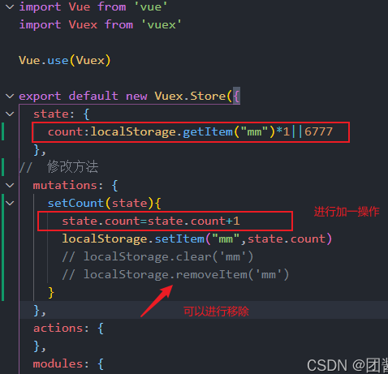

2.使用插件进行持久化存储（vuex-persist）

首先npm下载插件 ：npm install vuex-persist -s

vuex：store.js文件内容如下

```js
import Vue from 'vue'
import Vuex from 'vuex'
// 1. 导入包
import VuexPersistence from "vuex-persist"
 
Vue.use(Vuex)
 
export default new Vuex.Store({
  // 2. 配置为 vuex 的插件
  plugins: [createPersistedState()],
  state: {
    token: ''
    ...
  },
    action:{},
    mutation:{},
    
    //在vuex仓库中直接使用插件
    plugins: [ VuexPersistence({
  // 默认的是localStorage存储，可以修改成会话存储（window.sessionStorage）
  storage:window.localStorage
})]
    
})
```

##### 74.$refs的缺陷

1.mounted 不会保证所有的子组件也都被挂载完成。所以如果我们在父组件mounted的时候使用ref获取子组件时，可能会出现获取不到这个子组件的情况，我们就必须用this.$nextTick(()=>{ } )，将ref放在这个回调里面，在整个视图都被渲染之后运行这个代码，这个钩子在服务端渲染期间不会被调用。

2.会使父组件和子组件之间形成了紧密的耦合关系，这使得组件变得更加脆弱，如果其中一个组件发生了变化，则可能导致另一个组件无法正常工作。

##### 75.vue常见的一些修饰符，如.trim()  .stop()

https://blog.csdn.net/MiemieWan/article/details/111934238

### 计网相关知识

##### 1.**常见http状态码**	

100，接受的请求正在处理，信息类状态码

200(成功)服务器已成功处理了请求。

3xx(重定向)表示要完成请求，需要进一步操作。通常这些状态代码用来重定向。
301，永久性重定向，表示资源已被分配了新的 URL
302，临时性重定向，表示资源临时被分配了新的 URL
303，表示资源存在另一个URL，用GET方法获取资源
304，(未修改)自从上次请求后，请求网页未修改过。服务器返回此响应时，不会返回网页内容，而是从缓存拿到网页内容

4xx(请求错误)这些状态码表示请求可能出错，妨碍了服务器的处理
400(错误请求)服务器不理解请求的语法
401（未授权） 请求要求身份验证。 对于需要登录的网页，服务器可能返回此响应。 
403(禁止)服务器拒绝请求
404(未找到)服务器找不到请求网页

5xx(服务器错误)这些状态码表示服务器在尝试处理请求时发生内部错误。这些错误可能是服务器本身的错误，而不是请求的错误
500，(服务器内部错误)服务器遇到错误，无法完成请求
503，表示服务器处于停机维护或超负载，无法处理请求，通常这只是暂时状态

##### 2.Http和Https区别（高频）

1.`HTTP` 的URL 以http:// 开头，而HTTPS 的URL 以https:// 开头
2.`HTTP` 标准端口是80 ，而 HTTPS 的标准端口是443
5.`HTTP` 是超文本传输协议，信息是明文传输，无法加密，而HTTPS 是具有安全性ssl加密传输协议，安全性高于HTTP协议。
6.`HTTP`无需证书，是免费的，而HTTPS 需要CA机构颁发的SSL证书，一般免费证书少，因而需要一定费用。

##### 3.TCP UDP 区别

1.`TCP`向上层提供面向连接的可靠传输服务，使用流量控制和拥塞控制 ，需要通过三次握手建立连接，四次挥手释放连接；`UDP`向上层提供无连接不可靠传输服务，不使用流量控制和拥塞控制，无需建立连接。

2.tcp支持一对一，一对多，多对一和多对多交互通信；udp只支持是一对一通信

3.对数据准确性要求高，速度可以相对较慢的，比如文件传输可以选用`TCP`；虽然 `UDP` 并没有 `TCP` 传输来的准确，但是也能在很多实时性要求高的地方，比如适用于实时应用（IP电话、视频会议、直播等）。

##### 4.GET和POST区别（高频）

1.GET在浏览器回退不会再次请求，POST会再次提交请求
2.GET请求会被浏览器主动缓存，POST不会，要手动设置
3.GET请求参数会被完整保留在浏览器历史记录里，POST中的参数不会
4.GET请求在URL中传送的参数是有长度限制的，而POST没有限制
5.GET参数直接通过URL传递，POST放在Request body请求体中，所以GET请求不安全，POST请求更安全
Ge和post的选择：
1.私密性的信息请求使用post（如注册、登陆）。
2.查询信息使用get。

##### 5.三次握手和四次挥手

https://blog.csdn.net/CC_Together/article/details/105575364


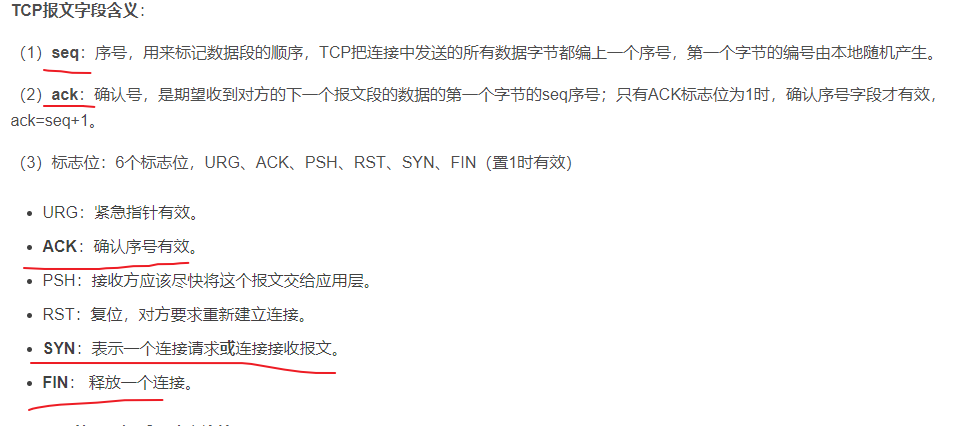

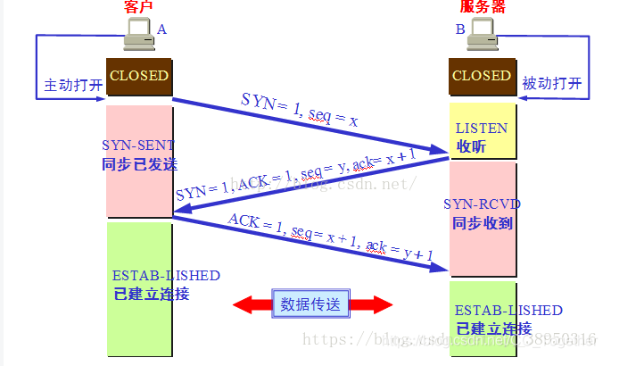

三次握手其实就是指建立一个TCP连接时，需要客户端和服务器总共发送3个包。进行三次握手的主要作用就是为了确认双方的接收能力和发送能力是否正常。

刚开始客户端处于 Closed 的状态，服务端处于 Listen 状态。

**第一次握手：**

客户端主动向服务端发送请求建立连接的报文（SYN=1，seq=x），并将自己初始序列号seq=x传递给服务端，此时客户端进入 `SYN_SENT` 同步已发送状态.

SYN = 1 表示请求连接，seq = x 表示起始序列号，通常默认为1

**第二次握手**：

服务端收到客户端的SYN报文之后，会以自己的 SYN 报文作为应答SYN=1，同时会把客户端的 初始序列号seq + 1 作为ACK 的值，表示自己已经收到了客户端的 SYN，并且也是指定了自己的初始化序列号 seq=y并进入 `SYN_RCVD` 同步已收到状态。（SYN=1, ACK=1, seq=y, ack=x+1）

##### 第三次握手：（ACK=1 ack=y+1 seq=x+1）

客户端收到 SYN 报文之后，会发送一个 ACK 报文，当然，也是一样把服务器的 seq + 1 作为 ACK 的值，表示已经收到了服务端的 SYN 报文，此时客户端处于 ESTABLISHED 建立连接状态。服务器收到 ACK确认 报文之后，也处于 ESTABLISHED 建立连接状态，此时，双方已建立起了连接。

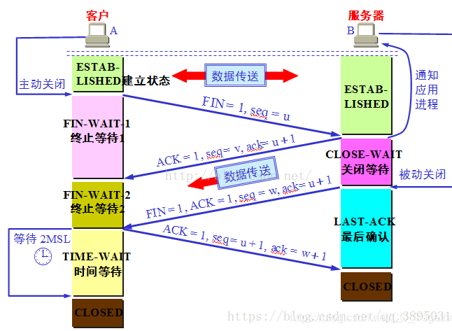

第一次挥手：（FIN=1 seq=u ）

客户端发送请求释放连接的报文FIN=1，以及初始序列号seq=u给客户端，并且停止在客户端到服务端方向上发送数据，也就是关闭了TCP连接，但是客户端仍然能接收从服务端传输过来的数据。客户端进入FIN_WAIT1（终止等待1）状态，等待服务端的确认。

第二次挥手：

服务端收到客户端发送连接释放报文，立即发出确认报文，（ACK=1，seq=v，ack=u+1）表示接收到客户端发送的释放连接的请求，并进入关闭等待状态。

第三次挥手：

当服务器做好了**释放**服务器端到客户端方向上**的连接准备**，也就是服务端没有数据需要传输给客户端了，再次向客户端发出**连接释放报文**（FIN=1，ACK=1，seq=w，ack=u+1），客户端进入LAST_ACK最后确认状态。

第四次挥手：

客户端收到 FIN 连接释放报文段之后，发出**确认报文段**（ACK=1，seq=u+1，ack=w+1），且把服务端的序列号值 +1 作为自己 ACK 报文的序列号值，此时客户端处于 TIME_WAIT 状态。需要等待2MSL ( 最大报文生存时间) 后再断开连接以确保服务端收到自己的 ACK 报文之后才会进入 CLOSED 状态，服务端收到 ACK 报文之后，就关闭TCP连接，处于 CLOSED 状态。

##### 6.输网址（url）到页面加载的全过程

**1.在浏览器中输入URL**

用户在输入后浏览器主进程会先判断用户输入的是URL还是关键字,如果是URL就交给我们网络进程了,如果是关键字就会调用我们默认的搜索引擎去合成一个带有搜索关键字的URL.

**2.查找缓存**

浏览器先查看浏览器缓存->系统缓存->路由缓存中是否有该地址的网址页面,如果有则显示页面的内容,如果没有则进行下一步

其中:

浏览器缓存指:浏览器会记录DNS一段时间,因此,只是第一个地方解析DNS请求

操作系统缓存:如果在浏览器缓存中不包含这个记录,则会使系统调用操作系统,获取操作系统的记录(保存最近的DNS查询缓存)

路由器缓存:当上述两个步骤均不能成功获取到DNS记录的时候,会继续搜索路由器缓存

ISP缓存:若上述均失败,继续向ISP搜索

**3.DNS域名解析**

本地查找没有找到缓存这个资源,浏览器向DNS服务器发起请求,会进行DNS解析，解析该URL中的域名对应的IP地址。DNS实际上就是域名和IP相互对应的数据库,因为IP地址难以记忆,而机器相互只认识IP地址,于是人们发明了域名,让域名和IP一一对应,它们之间的转换工作我们称之为DNS域名解析

**4.建立TCP连接**

解析出IP地址后，根据IP地址和默认80端口，通过三次握手和服务器建立TCP连接

**5.发起HTTP请求**

浏览器发起获取文件的HTTP请求，该请求报文作为TCP三次握手的第三次数据发送给服务器

**6.服务器响应请求并返回结果**

服务器对浏览器请求做出响应，并把对应的html文件发送给浏览器

**7.关闭TCP连接**

通过四次挥手释放TCP连接； 前 两 次挥手用于关闭一个方向的数据通道，后两次挥手用于关闭另外一个方向的数据通道。

**8.浏览器渲染**
客户端（浏览器）解析HTML内容并渲染出来，解析流程为：

构建DOM树：词法分析然后解析成DOM树（dom tree），dom树是由dom元素及属性节点组成，树的根节点是document对象

构建CSS规则树：生成CSS规则树（CSS Rule Tree）

构建render树：浏览器将DOM和CSSOM结合，并构建出渲染树（render tree）

布局（Layout）：计算出每个节点在屏幕中的位置

绘制（Painting）：即遍历render树，并使用UI后端层绘制每个节点。

**9.JS引擎解析过程：**
调用JS引擎执行JS代码（JS的解释阶段，预处理阶段，执行阶段生成执行上下文，VO，作用域链、回收机制等等）

 创建window对象：window对象也叫全局执行环境，当页面产生时就被创建，所有的全局变量和函数都属于window的属性和方法，而DOM Tree也会映射在window的doucment对象上。当关闭网页或者关闭浏览器时，全局执行环境会被销毁。

  加载文件：完成js引擎分析它的语法与词法是否合法，如果合法进入预编译

预编译：在预编译的过程中，浏览器会寻找全局变量声明，把它作为window的属性加入到window对象中，并给变量赋值为'undefined'；寻找全局函数声明，把它作为window的方法加入到window对象中，并将函数体赋值给他（匿名函数是不参与预编译的，因为它是变量）。而变量提升作为不合理的地方在ES6中已经解决了，函数提升还存在。

解释执行：执行到变量就赋值，如果变量没有被定义，也就没有被预编译直接赋值，在ES5非严格模式下这个变量会成为window的一个属性，也就是成为全局变量。string、int这样的值就是直接把值放在变量的存储空间里，object对象就是把指针指向变量的存储空间。函数执行，就将函数的环境推入一个环境的栈中，执行完成后再弹出，控制权交还给之前的环境。JS作用域其实就是这样的执行流机制实现的。


##### 7.浏览器缓存机制

https://blog.csdn.net/qq_39903567/article/details/115281234

浏览器第一次向服务器发起该请求后拿到请求结果，会根据响应报文中HTTP头的缓存标识，决定是否缓存结果，是则将请求结果和缓存标识存入浏览器缓存中

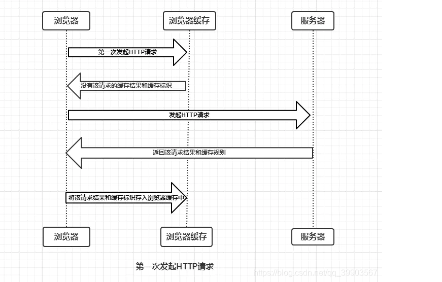

**1.强制缓存**

强制缓存就是向浏览器缓存查找该请求结果，并根据该结果的缓存规则来决定是否使用该缓存结果的过程，强制缓存的情况主要有三种(暂不分析协商缓存过程)，如下：

1. 不存在该缓存结果和缓存标识，强制缓存失效，则直接向服务器发起请求（跟第一次发起请求一致），如下图：

   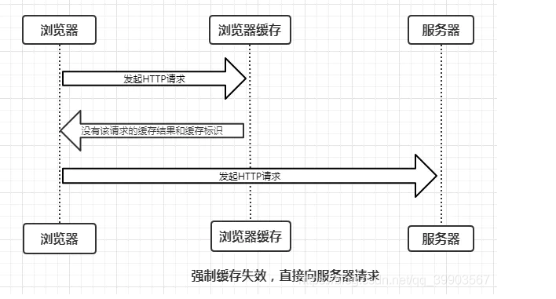

2.存在该缓存结果和缓存标识，且该结果尚未失效，强制缓存生效，直接返回该结果，如下图

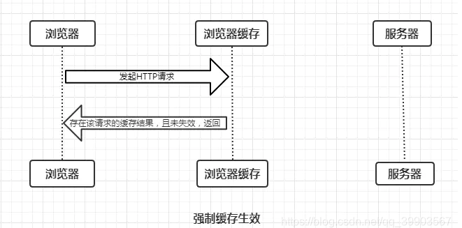

3.存在该缓存结果和缓存标识，但该结果已失效，强制缓存失效，则使用协商缓存(暂不分析)，如下图

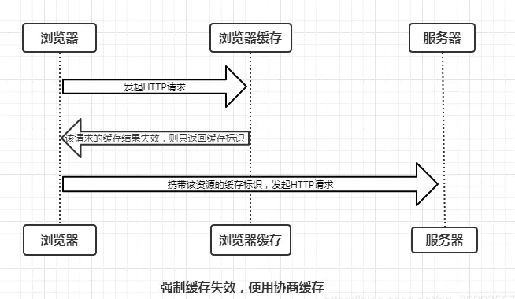

控制强制缓存的字段分别是Expires（到期）和Cache-Control中的max-age，其中Cache-Control优先级比Expires高。主要区别在于前者是绝对时间，如果服务器和客户端处于不同时区可能就会产生误差；而后者属于相对时间。

1.2 Cache-Control
在HTTP/1.1中，Cache-Control是最重要的规则，主要用于控制网页缓存，主要取值为：

public：所有内容都将被缓存（客户端和代理服务器都可缓存）
private：所有内容只有客户端可以缓存，Cache-Control的默认取值
no-cache：客户端缓存内容，但是是否使用缓存则需要经过协商缓存来验证决定
no-store：所有内容都不会被缓存，即不使用强制缓存，也不使用协商缓存
max-age=xxx (xxx is numeric)：缓存内容将在xxx秒后失效

**2.协商缓存**

协商缓存就是强制缓存失效后，浏览器携带缓存标识向服务器发起请求，由服务器根据缓存标识决定是否使用缓存的过程，主要有以下两种情况：

1. 协商缓存生效，返回304，如下

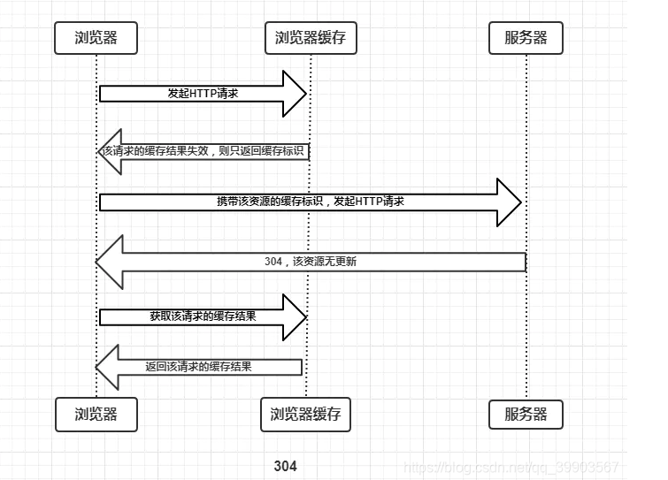

1. 协商缓存失效，返回200和请求结果结果，如下

   

   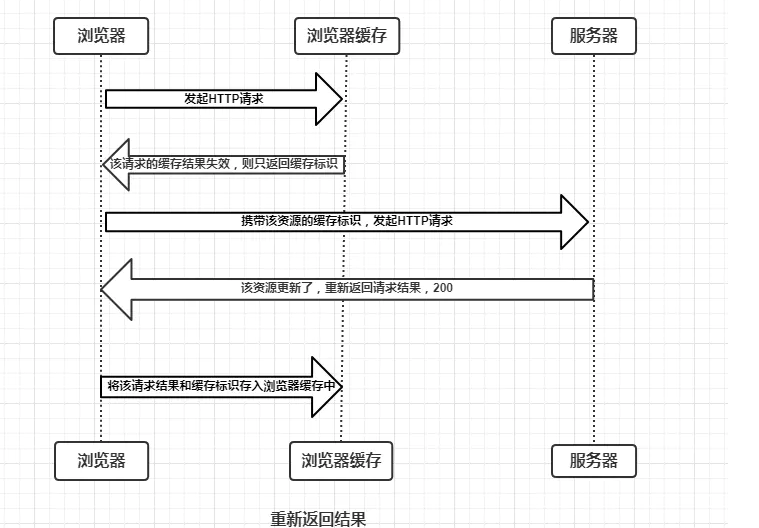

协商缓存的标识也是在响应报文的HTTP头中和请求结果一起返回给浏览器的，控制协商缓存的字段分别有：Last-Modified / If-Modified-Since和Etag / If-None-Match，其中Etag / If-None-Match的优先级比Last-Modified / If-Modified-Since高。

Last-Modified是服务器响应请求时，返回该资源文件在服务器最后被修改的时间，If-Modified-Since则是客户端再次发起该请求时，携带上次请求返回的Last-Modified值，根据这个If-Modified-Since的字段值与现在该资源在服务器的最后被修改时间做对比，若服务器的资源最后被修改时间大于If-Modified-Since的字段值，则重新返回资源，状态码为200；否则则返回304，代表资源无更新，可继续使用缓存文件。

Etag是服务器响应请求时，返回当前资源文件的一个唯一标识(由服务器生成)，If-None-Match是客户端再次发起该请求时，携带上次请求返回的唯一标识Etag值，根据If-None-Match的字段值与该资源在服务器的Etag值做对比，一致则返回304，代表资源无更新，继续使用缓存文件；不一致则重新返回资源文件，状态码为200。

##### 8.http1，http1.1，http2的区别

`HTTP 1.0` 的特点：

1. 每个请求/响应需要建立新的TCP连接，并在完成后关闭连接，导致较高的延迟。
2. 每个请求只能获得一个响应，然后连接关闭。
3. 无状态协议，服务器不会保留关于客户端的状态信息。
4. 不支持持久连接，每次请求都需要重新建立连接，增加了网络开销。
5. 不支持请求管道化，即客户端需要等待前一个请求的响应才能发送下一个请求。


HTTP 1.1相比HTTP 1.0

1.引入持久连接，允许多个请求和响应在同一个TCP连接上进行，减少了连接的建立和关闭的开销（就是通过tcp连接之后，可以发起多次http请求，貌似需要排队）、

2.支持请求管道化，客户端可以同时发送多个请求而无需等待前一个请求的响应回来之后才能发起下一次请求

3.加入了缓存处理（强缓存和协商缓存），通过例如cache-conrtol和Etag来控制缓存的时效性和更新；

4.引入了虚拟主机的概念，使得多个域名可以共享同一个IP地址。这样可以在同一个服务器上托管多个网站，提高服务器资源的利用率。

HTTP 2相比HTTP 1.x

1. `多路复用`：HTTP 2.0引入了多路复用技术，允许在同一个TCP连接上同时发送多个请求和响应。这样可以避免HTTP 1.x中的队头阻塞问题，提高请求的并发处理能力，加快页面加载速度。
2. `二进制格式`：HTTP 2.0使用二进制格式传输数据，取代了了HTTP 1.x解析基于文本。二进制格式的解析效率更高，减少了数据传输的大小，节省了带宽和时间。
3. 头部压缩，使用HPACK算法对请求和响应的头部进行压缩，减少了数据传输的大小。
4. 服务器推送，服务器可以主动向客户端推送资源，而不需要客户端明确请求，提高了性能和效率

##### 9.常见http请求响应头

https://blog.csdn.net/HHYZBC/article/details/124297104

请求报文：由请求行、请求头、[请求体](https://so.csdn.net/so/search?q=请求体&spm=1001.2101.3001.7020)组成。

请求行：由请求方式和[HTTP协议](https://so.csdn.net/so/search?q=HTTP协议&spm=1001.2101.3001.7020)和版本组成，如：GET / HTTP/1.1

**请求头：**

1.Accept：请求报头域，用于指定客户端可接受哪些类型的信息，Accept: text/html ，代表浏览器可以接受服务器回发的类型为 text/html；

2.Accept-Language：指定客户端可接受的语言类型，如Accept-Language:zh-CN,zh;q=0.9；

3.Accept-Encoding：浏览器申明自己接收的编码方法，Accept-Encoding: gzip, deflate ：通常指定压缩方法，是否支持压缩，支持什么压缩方法为gzip，deflate，（注意：这不是只字符编码）

4.Host（发送请求时，该报头域是必需的）：如Host:www.baidu.com 请求报头域主要用于指定被请求资源的域名和端口号，它通常从HTTP URL中提取出来的，这里就是请求的地址是百度；

5.Referer，如Referer:https://www.baidu.com/?tn=62095104_8_oem_dg 当浏览器向服务器发送请求的时候，一般会带上Referer，告诉服务器我是从哪个页面链接过来的，服务器籍此可以获得一些信息用于处理。

6.Cache-Control

Cache-Control:private，默认为private 响应只能够作为私有的缓存，不能再用户间共享

Cache-Control:public ，响应会被缓存，并且在多用户间共享。正常情况, 如果要求HTTP认证,响应会自动设置为 private.**Cache-Control:must-revalidate 响应在特定条件下会被重用，以满足接下来的请求，但是它必须到服务器端去验证它是不是仍然是最新的。

Cache-Control:no-cache ，响应不会被缓存,而是实时向服务器端请求资源。

Cache-Control:max-age=10 ，设置缓存最大的有效时间，但是这个参数定义的是时间大小（比如：60）而不是确定的时间点。单位是[秒 seconds]。

Cache-Control:no-store ，在任何条件下，响应都不会被缓存，并且不会被写入到客户端的磁盘里，这也是基于安全考虑的某些敏感的响应才会使用这个。

**7.Content-Type**：告诉服务器我们发送的请求信息是哪种格式的，不合适的Content-Type可能导致服务端无法正确接收我们的参数。

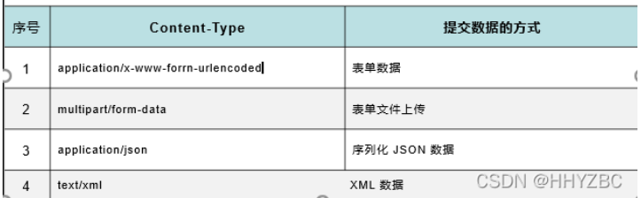

8.User-Agent：简称 UA ，它是一个特殊的字符串头，可以使服务器识别客户使用的操作系统及版本 浏览器及版本等信息 。

9.cookie：

##### 10.安全问题 ：CSRF 和 XSS 攻击？

`XSS`(`Cross-Site Scripting`，**跨站脚本攻击**)是一种代码注入攻击。攻击者在目标网站上注入恶意代码，当被攻击者浏览该网站时就会执行这些嵌入的恶意代码，这些脚本可以读取 `cookie，session tokens`，或者其它敏感的网站信息，对用户进行钓鱼欺诈，甚至发起蠕虫攻击等。

**XSS避免方式：**

1. `url`参数使用`encodeURIComponent`方法转义

   ```js
   function encodeForURL(str){
     return encodeURIComponent(str);
   };
   ```

2. 尽量不使用`InnerHtml`插入`HTML`内容

3. 使用特殊符号、标签转义符。

   ```js
   //将html标签进行转义，将html的属性进行转义，因为属性都是用单引号或双引号包裹，最终在浏览器输出的结果是一样的
   var escapeHtmlProperty = function(str){
       if(!str) return '';
       str = str.replace(/&/g,'&amp;');
       str = str.replace(/>/g,'&lt;');
       str = str.replace(/>/g,'&gt;');
       str = str.replace(/"/g,'&quto;');
       str = str.replace(/'/g,'&#39;');
       return str;
   }
   escapeHtml(content);
   
   
   ```

   

`CSRF`（`Cross-site request forgery`）**跨站请求伪造**：攻击者诱导受害者进入第三方网站，在第三方网站中，向被攻击网站发送跨站请求。利用受害者在被攻击网站已经获取的注册凭证，绕过后台的用户验证，达到冒充用户对被攻击的网站执行某项操作的目的。

**CSRF避免方式：**

 1.**Token 验证：（用的最多）**

 1.1服务器发送给客户端一个 加密后的token ；

 1.2客户端提交的表单中需要携带这个 token 。

 1.3服务器会检验这个token是否正确，如果这个 token 不正确，那么服务器拒绝这个请求。

##### 11.单点登录（上次面试问到过，深圳编办系统多系统只使用单个登录页登录，我没回答上来）

https://blog.csdn.net/qq_41595452/article/details/122066984

cookie和redies实现：

用cookie作为媒介存放用户凭证。 用户登录系统之后，会返回一个加密的cookie，当用户访问子应用的时候会带上这个cookie，授权以解密cookie并进行校验，校验通过后即可登录当前用户。
① 系统会先将用户的登录信息存入 redis中，其在 redis 的 key 值是生成的唯一值 （可以包含 IP、用户 id、UUID等值），value 值存放用户的登录信息。

② 然后系统会将这名用户在 redis 中的 key 值存入该用户的 cookie 中，用户每次访问任意子系统时都会带着这个 cookie。

③ 用户在访问其他子系统发送请求时，都会带着客户端的 cookie 进行请求，而客户端的 cookie 已经存入了该用户在 redis 中的 key 值，这样其他模块在处理用户的请求时，可以先获取用户 cookie中的 key 值，然后拿着这个 key 值到 redis 中进行查询，如果在 redis 中能查询到该用户相应的登录信息，就说明该用户已登录，就不需要用户进行重复登录了。


#### 手搓的笔试题

1.数组取重（我这里的取重是两个不同数组取重）

```js
 //数组取重  这里有一个问题 当你某个数组内本身就有重复的属性值的时候，取出来的会有两个重复的，我觉得解决办法可以先将取重的数组去重，在去取重
        const arr1 = [1, 2, 3, 4, 5]
        const arr2 = [2, 6, 3, 2]
        let arr3 = []
        //方法1
        // arr2.forEach((item, index) => {
        //     if (arr1.includes(item)) {
        //         arr3.push(item)
        //     }
        // })
        // console.log(arr3) //[2, 3, 2]

        //方法2 返回true和返回一个判断为true，这两种写法都是可以的
        arr3 = arr1.filter((item, index) => {
            // return arr2.includes(item)
            if (arr2.includes(item)) {
                //这个return值我们写任意的通过判断为true的值都可以，如 return item ；return 1，因为这个return true只是告诉我们你遍历到这个元素是符合要求的，返回出去，并不是将
                // return 后面的值返回出去，这里我们需要注意
                return true
            }
        })

//方法3 双重for循环也可以
  for (let i = 0; i < arr1.length; i++) {
            for (let j = 0; j < arr2.length; j++) {
                if (arr1[i] == arr2[j]) {
                    arr3.push(arr1[i])
                }
            }
        }


//方法4 是个错误方法，我放在这里是让我能明白，map和filter的区别
          arr3 = arr1.map((item, index) => {
            // 这一步是错的 因为map返回的和filter不一样，filter是判断为true的元素返回出去，而map返回的直接就是那个你处理过的元素
            // return arr2.includes(item)
            //返回的结果为[undefined, 2, 3, undefined, undefined]，说明无法用map实现取重，因为不符合条件的判断一样会返回出去，值为undefined
            if (arr2.indexOf(item) != -1) {
                return item
            }
        })
        console.log(arr3)
```

2.单个数组中取重

```js
let arr1 = [2, 6, 3, 2, 10, 5, 1, 2, 3, 1, 2, 3, 11]

//方法1 这个方法特别巧妙，就是判断某一个元素在这个数组中首尾存在下标是否不一致，不一致就说明这个元素存在两个或以上，然后为了防止取到的数组中有多个这个元素，在利用逻辑中断判断一下，取重数组中不存在这个元素
 function res(arr) {

            var temp = []

            arr.forEach(function (item) {

                if (arr.indexOf(item) !== arr.lastIndexOf(item) && temp.indexOf(item) === -1) {

                    temp.push(item)

                }

            })

            return temp
        }

//方法2 双重for循环
function quchong(arr) {
            let arr2 = []
            for (let i = 0; i < arr.length; i++) {
                //第二个循环需要开始的下标比第一层循环大1
                for (let j = i + 1; j < arr.length; j++) {
                    //当两个元素相等，删除后面那个元素，此时数组长度减少，我们要j--，因为此时原本的下一个元素下标是j+1，而删掉了目前j这个下标元素，所以此时下个元素的下标也为j
                    if (arr[i] == arr[j]&& arr2.indexOf(arr[j]) == -1) {
                        arr2.push(arr[j])
                        arr.splice(j, 1)
                        j--
                        //此时我们取到的重复数组可能含有多项相同的,我们可以将这一项去掉，或者在最后用set去重
                        //arr = arr.filter(item => item != arr[j])
                    }
                }

            }
            
            return arr2
        }
        console.log(quchong(arr1))

```

3.数组去重

```js
 const arr1 = [2, 6, 3, 2, 10, 5, 1, 2, 3, 1, 2, 3, 11]
      
//方法1，双重for循环
        for (let i = 0; i < arr1.length; i++) {
            //第二个循环需要开始的下标比第一层循环大1
            for (let j = i + 1; j < arr1.length; j++) {
                //当两个元素相等，删除后面那个元素，此时数组长度减少，我们要j--，因为此时原本的下一个元素下标是j+1，而删掉了目前j这个下标元素，所以此时下个元素的下标也为j
                if (arr1[i] == arr1[j]) {
                    arr1.splice(j, 1)
                    j--
                }
            }
        }
        console.log(arr1)

//方法2 利用set 配合Array.from方法或扩展运算符
       console.log([...new Set(arr1)])
      console.log(Array.from(new Set(arr1)))

//方法3，
     function unique(arr) {
            let array = []
            arr.forEach((item, index) => {
                if (!array.includes(item)) {//includes 检测数组是否有某个值
                    array.push(item)
                }
            })
            return array
        }
        console.log(unique(arr1))

//方法4  下面两种return原理是一样的，利用indexOf判断出来是符合条件的数组元素的第一个的下标，其他符合条件的下标忽略
   function qu(arr) {
            return arr.filter((item, index) => {
                return arr.indexOf(item) == index
                // return arr.findIndex(item1 => item1 == item) == index

            })
        }
```

手写冒泡排序，快速排序，数组去重（最好说三种方法），扁平化数组，


